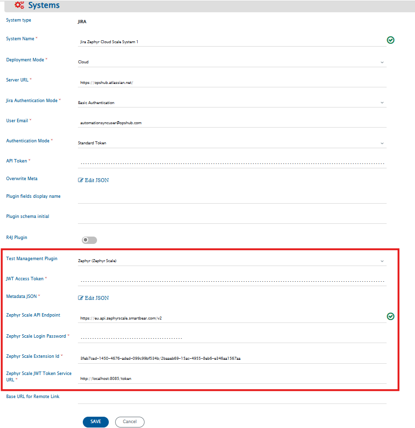
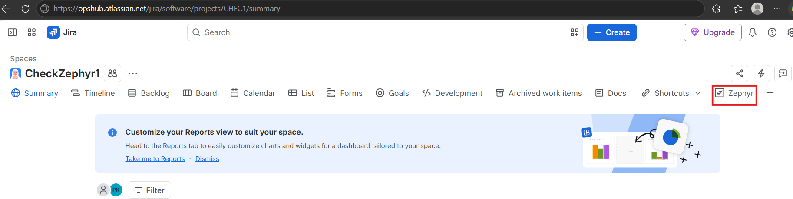
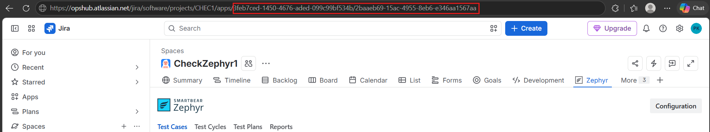
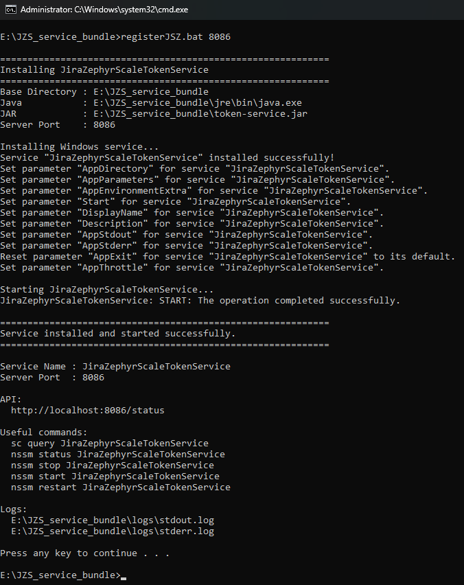
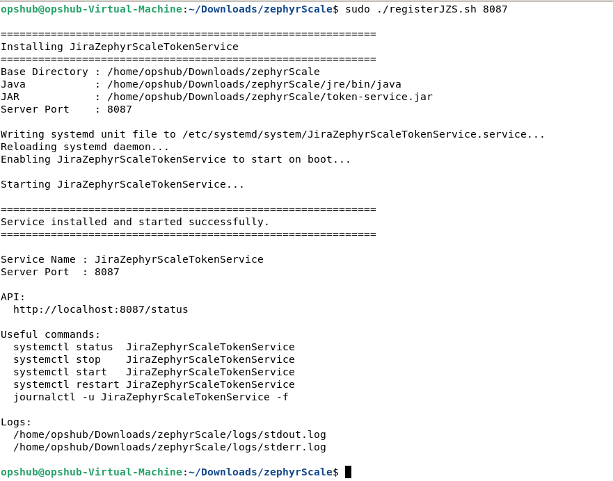

**Zephyr (formerly known as Zephyr Scale)**

# Prerequisites

* Zephyr (formerly known as Zephyr Scale) must be installed on your Jira Cloud domain.  
* A user access token for integration user is required to synchronize any entities from the Zephyr plugin. Check [User Token Generation](#user-token-generation). 
* Some Zephyr Scale sync features use non-public APIs of Zephyr. To use these features, you must set up the Zephyr Scale JWT Token Service, which generates the authentication tokens needed for the sync.
    * Refer to [Supported Features using non-public API](#supported-features-using-non-public-api) section for a list of features that require non-public APIs.
    * Refer to [Setting Up Zephyr Scale JWT Token Service](#setting-up-zephyr-scale-jwt-token-service) section for setup instructions.

>**Note**: Make sure the Zephyr service account is the same as the Jira system service account.

# System Configuration

Before you start with the integration configuration, you must first set up the [Jira system](jira.md#system-configuration) in <code class="expression">space.vars.OIM</code>.

Click [System Configuration](../integrate/system-configuration.md) to learn the step-by-step process to configure a system.

Refer the screenshot given below for reference.

<p align="center">
  
</p>

| **Field Name**                  | **When field is visible on the System form** | **Description**                                                                                                                                                                                                                                                                                                                                                                                                                                                                                                                                                                                                                                              |
|---------------------------------|--------------------------------------------|--------------------------------------------------------------------------------------------------------------------------------------------------------------------------------------------------------------------------------------------------------------------------------------------------------------------------------------------------------------------------------------------------------------------------------------------------------------------------------------------------------------------------------------------------------------------------------------------------------------------------------------------------------------|
| **JWT Access Token**            | Only when Jira's deployment type is Cloud and Zephyr (Zephyr Scale) is selected as the test management plugin | Provide the access token generated in Zephyr for the user given in the "User Email" field. For more details on Access Token, please refer to [User Token Generation](#user-token-generation)                                                                                                                                                                                                                                                                                                                                                                                                                                                                 |
| **Metadata JSON**               | Only when Jira's deployment type is Cloud and Zephyr (Zephyr Scale) is selected as the test management plugin | This data is in JSON format according to our knowledge of system metadata (entity type, field names, lookup...), the user can edit it based on his/her Jira Zephyr instance details for system/custom metadata. For the format and guidance related to filling these details in JSON form, please refer to **Understanding JSON Input** section.                                                                                                                                                                                                                                                                                                             |
| **Zephyr Scale API Endpoint**   | Only when Jira's deployment type is Cloud and Zephyr (Zephyr Scale) is selected as the test management plugin | Provide the Zephyr Scale API endpoint for API requests. By default, https://api.zephyrscale.smartbear.com/v2/ API endpoint will be used. The URL must have a prefix for the location where Zephyr Scale data is hosted. The locations, according to the [Zephyr Scale documentation](https://support.smartbear.com/zephyr-scale-cloud/api-docs/#section/Authentication/Generate-a-Key), can be US, Europe, Australia and Germany. Hence, the API URL can be one of these: https://api.zephyrscale.smartbear.com/v2, https://eu.api.zephyrscale.smartbear.com/v2, https://au.api.zephyrscale.smartbear.com/v2 or https://de.api.zephyrscale.smartbear.com/v2. |
| **Zephyr Scale Login Password** | Only when Jira's deployment type is Cloud and Zephyr (Zephyr Scale) is selected as the test management plugin | Provide the Zephyr Scale Password for the integration user whose email is added in the above user email field.                                                                                                                                                                                                                                                                                                                                                                                                                                                                                                                                               |
| **Zephyr Scale Extension Id**   | Only when Jira's deployment type is Cloud and Zephyr (Zephyr Scale) is selected as the test management plugin | Provide the Zephyr Scale Extension Id for the Jira Instance. For steps on how to get the Extension Id, refer to the section: [Zephyr Scale Extension ID](#zephyr-scale-extension-id)                                                                                                                                                                                                                                                                                                                                                                                                                                                                         |
| **Zephyr Scale JWT Token Service URL**   | Only when Jira's deployment type is Cloud and Zephyr (Zephyr Scale) is selected as the test management plugin | Provide the Zephyr Scale JWT Service Endpoint that is required for obtaining the JWT token to perform API requests. For steps on how to set-up and obtain the service url, refer to the section: [Setting Up Zephyr Scale JWT Token Service](#setting-up-zephyr-scale-jwt-token-service)                                                                                                                                                                                                                                                                                                                                                                     |

## Understanding JSON Input

* The field metadata details needed for integrating Jira Zephyr system with other systems are provided at the time of system configuration in the field 'Metadata JSON' in the form of JSON.  
* If the internal name is not given correctly, it will lead to failures in the integration.  
* Refer to [Understanding JSON Metadata Input](../integrate/system-configuration.md#understanding-json-metadata-input) for more details on the JSON inputs.  
* Refer to [JSON Metadata Sample](sample-json-file-for-jira-zephyr.md) for a sample JSON for Jira Zephyr entities.  
* Users can change the display name of the entities.  
* The internal name of each system field must match exactly as shown in the template JSON.  
* The internal name of a custom field must match the one defined in the end system. For how to find custom field name, refer [Find Custom Field Names](#find-custom-field-names).

# Mapping Configuration

* If the Folder entity is configured in <code class="expression">space.vars.OIM</code> as a separate entity, map the Folder in a link relationship with Test Plan, Test Case, and Test Cycle entities.  
  * The **folderType** field is mandatory in folder synchronization.  
* If the Folder entity is not configured separately, use the check-and-create functionality with the **OH_Folder_path** field.  
  * <code class="expression">space.vars.OIM</code> uses the "/" character to separate folders in a folder path. If the source system uses a different path separator, users must create advanced mapping to convert that separator to the "/" string.  
  * For example: if the Source system gives "\\" as path separator, then advance XSLT for this field will be as follows:

```xml
<OH_Folder_Path>
  <xsl:value-of
      select="replace(SourceXML/updatedFields/Property/Subject, '\\', '/')"
      xmlns:xsl="http://www.w3.org/1999/XSL/Transform"/>
</OH_Folder_Path>
```

* <code class="expression">space.vars.OIM</code> supports synchronization of test steps through the field '''OH_Test_Steps'''.
* Custom field of test steps will be synced with additional fields as bellow:

```xml
<OH_Test_Steps op_type="TestSteps">
	<xsl:for-each xmlns:xsl="http://www.w3.org/1999/XSL/Transform" select="SourceXML/updatedFields/Property/OH__Test__Steps/com.opshub.eai.TestStep">
		<com.opshub.eai.TestStep>
			<order>
				<xsl:value-of select="order"/>
			</order>
			<id>
				<xsl:value-of select="id"/>
			</id>
			<step>
				<xsl:value-of select="step"/>
			</step>
			<expected>
				<xsl:value-of select="expected"/>
			</expected>
			<description>
				<xsl:value-of select="description"/>
			</description>
			<calledTestCaseId>
				<xsl:value-of select="calledTestCaseId"/>
			</calledTestCaseId>
			<OHAttachments>
				<xsl:for-each select="attachments/OHAttachment">
					<xsl:element name="{concat('attachment_',position())}">
						<filename>
							<xsl:value-of select="fileName"/>
						</filename>
						<addedByUser>
							<xsl:value-of select="addedByUser"/>
						</addedByUser>
						<contentLength>
							<xsl:value-of select="contentLength"/>
						</contentLength>
						<contentType>
							<xsl:value-of select="contentType"/>
						</contentType>
						<contentBase64>
							<xsl:value-of select="contentBase64"/>
						</contentBase64>
						<attachmentURI>
							<xsl:value-of select="attachmentURI"/>
						</attachmentURI>
						<inlineAttachmentURI>
							<xsl:value-of select="inlineAttachmentURI"/>
						</inlineAttachmentURI>
						<updateTimeStamp>
							<xsl:value-of select="updateTimeStamp"/>
						</updateTimeStamp>
						<label>
							<xsl:value-of select="label"/>
						</label>
						<fileComment>
							<xsl:value-of select="fileComment"/>
						</fileComment>
						<attachmentId>
							<xsl:value-of select="attachmentId"/>
						</attachmentId>
						<attachmentReferenceTypes>
							<xsl:for-each select="attachmentReferenceTypes/com.opshub.eai.AttachmentReferenceType">
								<op_set>
									<com.opshub.eai.AttachmentReferenceType>
										<xsl:value-of select="."/>
									</com.opshub.eai.AttachmentReferenceType>
								</op_set>
							</xsl:for-each>
						</attachmentReferenceTypes>
						<uniqueCode>
							<xsl:value-of select="uniqueCode"/>
						</uniqueCode>
						<attachmentType>
							<xsl:variable name="xPathVariable" select="attachmentType"/>
							<xsl:value-of select="attachmentType"/>
						</attachmentType>
					</xsl:element>
				</xsl:for-each>
			</OHAttachments>
			<additionalFields>
				<xsl:element name="customCheckBox">
					<xsl:value-of select="additionalFields/customFields/customCheckBox"/>
				</xsl:element>
				<xsl:element name="customUser">
					<xsl:value-of select="additionalFields/customFields/customUser"/>
				</xsl:element>
				<xsl:element name="customMultiSelect">
					<xsl:for-each xmlns:xsl="http://www.w3.org/1999/XSL/Transform" select="additionalFields/customFields/customMultiSelect/string">
						<fieldvalue>
							<xsl:variable name="xPathVariable" select="text()"/>
							<xsl:choose>
								<xsl:when test="$xPathVariable='red'">
									<xsl:value-of select="'red'"/>
								</xsl:when>
								<xsl:when test="$xPathVariable='green'">
									<xsl:value-of select="'green'"/>
								</xsl:when>
								<xsl:when test="$xPathVariable='blue'">
									<xsl:value-of select="'blue'"/>
								</xsl:when>
								<xsl:when test="$xPathVariable='yello'">
									<xsl:value-of select="'yello'"/>
								</xsl:when>
							</xsl:choose>
						</fieldvalue>
					</xsl:for-each>
				</xsl:element>
				<xsl:element name="customText">
					<xsl:value-of select="additionalFields/customFields/customText"/>
				</xsl:element>
				<xsl:element name="customMultiText">
					<xsl:value-of select="additionalFields/customFields/customMultiText"/>
				</xsl:element>
				<xsl:element name="customDesi">
					<xsl:value-of select="additionalFields/customFields/customDesi"/>
				</xsl:element>
				<xsl:element name="customNumber">
					<xsl:value-of select="additionalFields/customFields/customNumber"/>
				</xsl:element>
				<xsl:element name="customSelect">
					<xsl:value-of select="additionalFields/customFields/customSelect"/>
				</xsl:element>
				<xsl:element name="customDate">
					<xsl:value-of select="additionalFields/customFields/customDate"/>
				</xsl:element>
			</additionalFields>
		</com.opshub.eai.TestStep>
	</xsl:for-each>
</OH_Test_Steps>
```

# Integration Configuration

## Criteria Configuration & Target Lookup
* <code class="expression">space.vars.OIM</code> supports criteria and target lookups for the entity types Test Case, Test Cycle, and Test Plan via a private API.  
  * The criteria query can be obtained by inspecting the browser’s developer tools (Inspect tab).
* <code class="expression">space.vars.OIM</code> supports criteria and target lookups for the Test Folder entity type on only one **folderType** field.

# Known Behavior/ Limitations

* Polling for all entity types requires a full scan of all records; therefore, choose the polling frequency judiciously. Refer [Best Practices for Polling Frequency](../integrate/best-practises.md#polling-frequency-scheduling)
* Shared Step is not supported.
* The following limitations exist in <code class="expression">space.vars.OIM</code> due to API restrictions:
  * Attachment write support is not available due to API limitation.
  * Delete and Archive functionality is not supported.
  * For Test Execution,  
    * Criteria and target lookup are not supported.  
    * The **Release Version** and **Environment** fields cannot be modified.
  * For Test Environment,  
    * Criteria and target lookup are not supported.  
    * Updates to the **Description** field will not work and will return the error _An environment with this name already exists._
  * For Test Cycle,  
    * The **Iteration** field is not synchronized.  
      * **Reason:** Zephyr API does not provide or handle any information related to this field.
* If you plan to use sync features that rely on Zephyr Scale's non-public APIs, you must configure the Zephyr Scale JWT Token Service. Since non-public APIs may change without notice, if you experience issues with features, please contact OpsHub Support for assistance. Refer to [Supported Features using non-public API](#supported-features-using-non-public-api) section for the list of features that use non-public APIs.

# Appendix

## User Token Generation

* To generate the token, navigate to your user profile → Zephyr API Access Token section.
* Click **Create Access Token**, then copy and save the generated token.

<p align="center">
  
</p>

## Find Custom Field Names

* To get the custom field information go to **Zephyr** → **Configuration** → **CUSTOM FIELDS** subsection.

<p align="center">
  
</p>

* For example, in the above image, **reviewer (Custom)** is the internal name of a custom field.


## Supported Features using non-public API

The following capabilities require the use of non-public Jira Zephyr Scale APIs to support the associated functionality.

| Capabilities                                | What it enables                                                                                                              |
|---------------------------------------------|------------------------------------------------------------------------------------------------------------------------------|
| Comments/Discussions                        | Enables end-to-end collaboration and discussion synchronization across tools                                                 |
| Attachments                                 | Ensures supporting documents, screenshots, and evidence remain available across connected systems                            |
| Step-level attachments                      | Preserves and synchronizes test execution evidence at the test step level                                                    |
| Test Plan's custom fields sync              | Maintains customer-specific Test Plan field data consistently across applications                                            |
| Relationship & traceability synchronization | Keeps linked entities and traceability relationships synchronized across systems, ensuring accurate end-to-end traceability. |
| Retrieval of test entities using filters    | Enables efficient incremental synchronization by identifying only changed records                                            |
| Adding/Removing Test Cases from Test Cycles | Keeps test planning and execution scope synchronized across systems                                                          |
| Test Plan updates                           | Ensures Test Plan changes remain aligned across connected applications                                                       |
| Folder updates                              | Keeps test organization and folder hierarchy synchronized                                                                    |
| Archive test entities                       | Preserves archive state and lifecycle consistency across systems                                                             |
| Delete test entities                        | Prevents stale or orphaned data by synchronizing deletions                                                                   |
| Authentication for the above operations     | Enables secure and fully supported integration without dependency on non-public APIs                                         |


## Zephyr Scale Extension ID

To get the Zephyr Scale Extension ID, follow the below steps:
  1. Navigate to any Jira project with Zephyr plugin enabled and then to the Zephyr section.
  
  <p align="center">
    
  </p>

  2. In the url, after the `apps`, there will be the extension id for the Zephyr Scale plugin.
    Example URL: `https://<ORGANIZATION_NAME>.atlassian.net/jira/software/projects/<PROJECT_KEY>/apps/<EXTENSION_ID>`

  <p align="center">
    
  </p>

## Setting Up Zephyr Scale JWT Token Service

The Jira Zephyr Scale JWT Token Service can be installed either on the same server as OIM or on a separate server. If you plan to host the service on a different server, refer to [Hosting Zephyr Scale JWT Token Service on a Separate Server](#hosting-zephyr-scale-jwt-token-service-on-a-separate-server) before proceeding.

### Pre-Requisites

Please ensure the following requirements are met before installing the service.

* **Install a supported browser**: At least one of the following browsers must be installed on the system where service is deployed:
  1. Google Chrome
  2. Microsoft Edge
  3. Mozilla Firefox


* **Log in to Jira once**: The service uses your browser session to generate authentication tokens. 
  * Before installing the service:
    1. Open your Jira instance URL in one of the supported browsers.
    2. Sign in to Jira using the OpsHub dedicated integration user account.
    3. Complete the Multi-Factor Authentication steps that Jira requests. 
    4. After completion, verify that you can successfully access Jira after logging in.
  * Important:
    * Ensure that Multi-Factor Authentication (MFA) is disabled for the dedicated integration user account used by the service. If MFA is enabled, the service will be unable to authenticate successfully, resulting in login failures and preventing JWT token generation.
    * After the browser profile is initialized, ensure that the dedicated integration user account used by the service can authenticate successfully.


### Installation Steps

* **Step 1**: Download the Service Package
  * Download the Jira Zephyr Scale JWT Token Service package from the provided location:
    * Link for the package: [Jira Zephyr Scale JWT Token Service](https://opshubtrial-my.sharepoint.com/:u:/g/personal/support_opshub_com/IQDXuaX4zshPRb7hgHJss-AmAXjgXA1iLgICGTW9ijIyBfs?e=xd84JZ)
  * After downloading, extract the ZIP file to the desired folder. Ensure all the files are extracted successfully.

* **Step 2**: Copy the Java Runtime (JRE) to the Service folder
  * Locate the jre folder from your OpsHub installation: `<OIM_Installation_Directory>\OpsHub_Resources`.
  * Copy the entire jre folder and paste it into the root folder of the extracted Zephyr Scale Service package.


* **Step 3**: Install the service
  * Windows: 
    1. Open Command Prompt as Administrator.
    2. Navigate to the service installation folder.
    3. Run the installation batch file in Command Prompt: 
       * `registerJZS.bat`
    4. The above command will perform the installation of this service on the default port 8085. In order to perform the installation on any other port (example: 9001), run the command: 
       * `registerJZS.bat 9001`
    5. Open Services (services.msc) and confirm that the following service is running: **Jira Zephyr Scale Token Service**.


  <p align="center">
    
  </p>
  

  * Linux:
    1. Open a terminal session.
    2. Navigate to the service installation folder.
    3. Grant execute permission to the script if required: 
     * `chmod +x registerJZS.sh`
    4. Install the service: 
       * `sudo ./registerJZS.sh`
    5. The above command will perform the installation of this service on the default port 8085. In order to perform the installation on any other port (example: 9001), run the command: 
       * `sudo ./registerJZS.sh 9001`
    6. Verify that the service has been installed successfully: 
       * `systemctl status <service-name>`


  <p align="center">
    
  </p>


### Post-Installation Steps

* Once installation is complete:
  1. Verify that the service is running.
  2. Confirm that the browser used during setup can access Jira.
  3. Ensure the Jira account can successfully log in.
  4. Confirm that the selected port is accessible from the OIM server.


* **Determine the Service URL**: You will need the Service URL while configuring your Jira Zephyr Scale system in OpsHub. Follow the below steps to get the Service URL:
  * Obtain the machine IP Address:
    * For Windows:
      1. Open Command Prompt.
      2. Execute the following command: `ipconfig`.
      3. Note the IPv4 Address of the active network adapter. That will be the IP Address of your machine.
    * For Linux:
      1. Open a terminal.
      2. Execute the following command: `hostname -I`.
      3. Note the displayed IP address.

  * Build the Service URL:
    * Use the following format: `http://<IP_ADDRESS>:<PORT>/token`.
    * For Example, if the IP Address is `10.13.1.2` and the port number is `8085`, then the Service URL will be: `http://10.13.1.2:8085/token`.
    * Provide this URL during Jira Zephyr Scale system configuration in OIM.


### Hosting Zephyr Scale JWT Token Service on a Separate Server
  * The Jira Zephyr Scale JWT Token Service can be installed on a different server than the one running OpsHub Integration Manager (OIM).
  * The installation process remains the same as described above: [Setting Up Zephyr Scale JWT Token Service](#setting-up-zephyr-scale-jwt-token-service). However, please ensure the following:
    * All prerequisites are completed on the machine hosting the service, including:
      1. Installing a supported browser.
      2. Logging in to Jira instance with the dedicated integration user account.
      3. Completing the required one-time MFA Authentication steps.
    * The OIM server can communicate with the machine hosting the service.
    * The configured service port (default: 8085) and service URL are accessible and reachable from the OIM server and MFA is disabled for the dedicated integration user.


  * **Note**:
    * The JRE must match the operating system on which the Jira Zephyr Scale JWT Token Service is being installed.
    * If OIM and the Jira Zephyr Scale JWT Token Service are installed on the same Windows machine, you can directly use the JRE available under the OIM installation directory.
    * If OIM is installed on Windows but the Jira Zephyr Scale JWT Token Service is being hosted on Linux (or vice versa), the JRE copied from the OIM installation may not be compatible with the target operating system.
    * In such cases, please contact OpsHub Support to obtain the appropriate JRE package for the operating system hosting the Jira Zephyr Scale JWT Token Service.