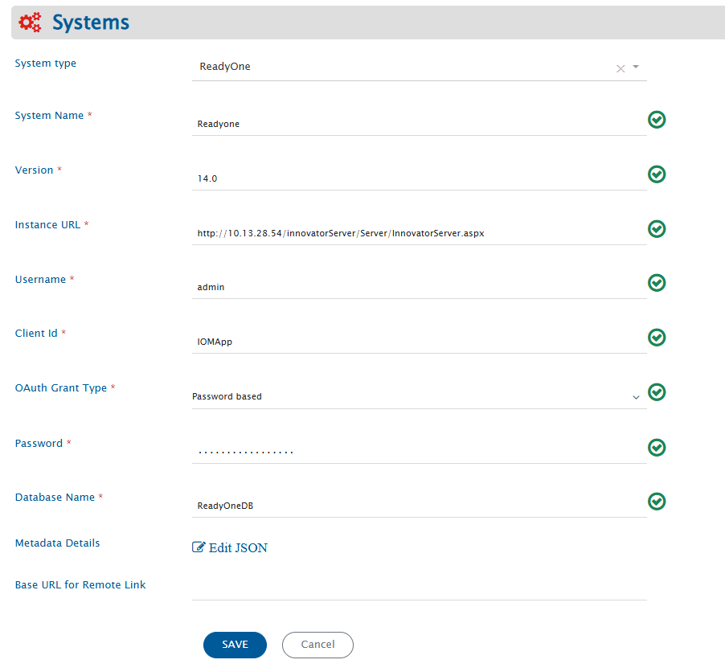
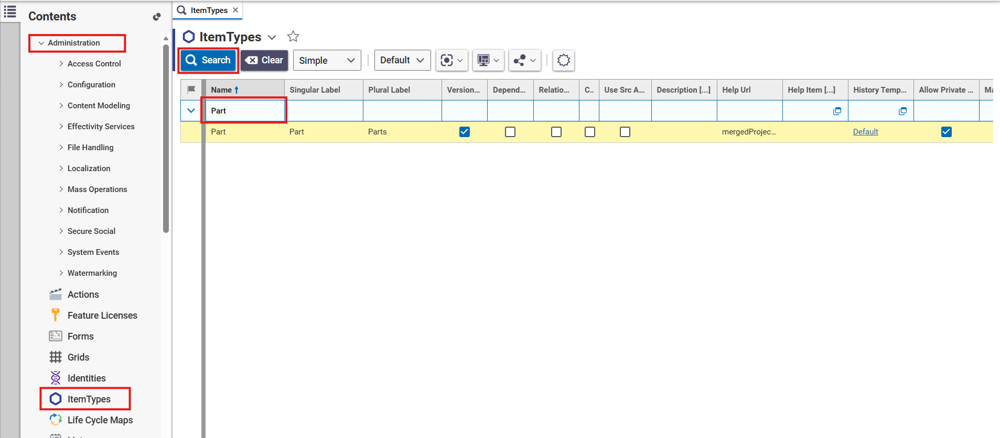
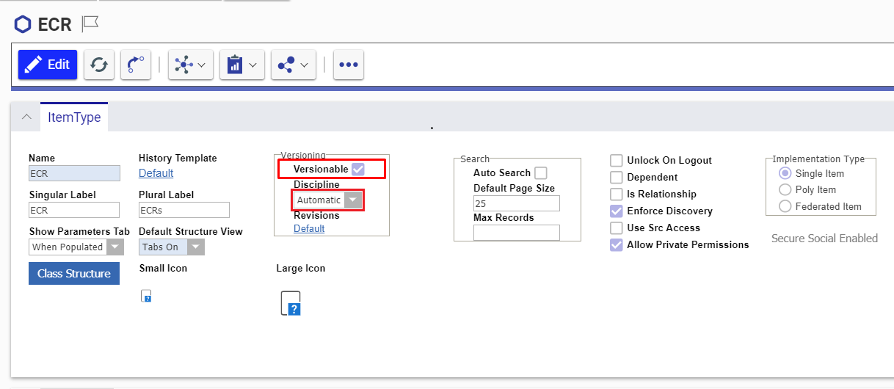
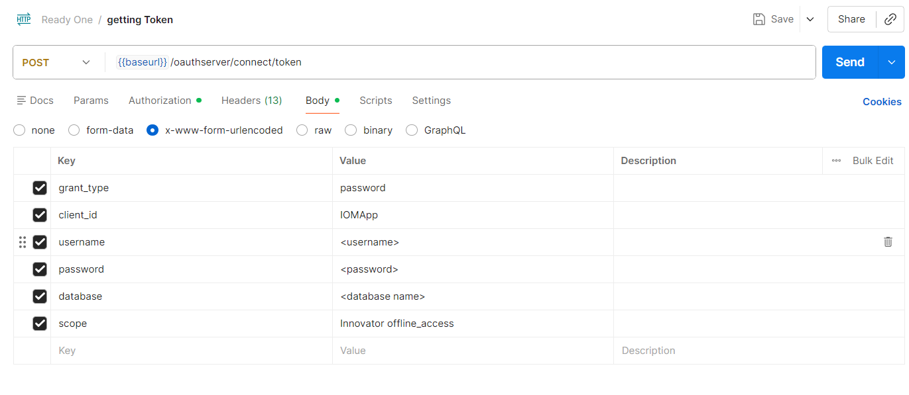
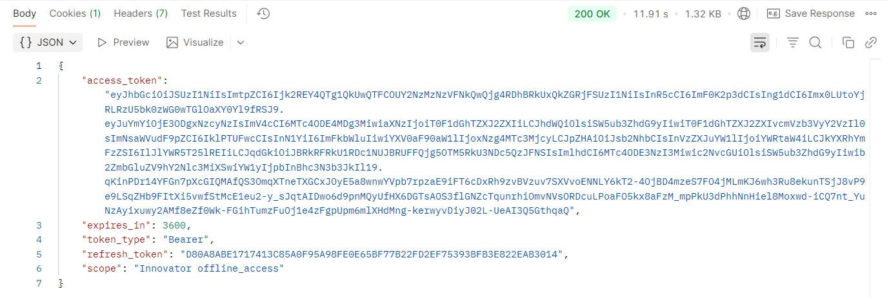

# Prerequisites

## User Privileges

- Create a user in ReadyOne that is dedicated for <code class="expression">space.vars.OIM</code>. The user shouldn't perform any other action from ReadyOne user interface. Refer to [Add User in ReadyOne](#add-users) section to learn how to add a new user in ReadyOne.
- The user identity of the user dedicated for <code class="expression">space.vars.OIM</code> must have the following permissions for the 'item type' to be integrated:

| **Permission Types**         | **Justification**                                                                                                                                                                                        | **Needed When**                                                                                                                                                | **How To**                                                                                                                           |
|-----------------------------|-----------------------------------------------------------------------------------------------------------------------------------------------------------------------------------------------------------|----------------------------------------------------------------------------------------------------------------------------------------------------------------|---------------------------------------------------------------------------------------------------------------------------------------|
| Get                         | To get values of each field for particular item of 'item type' to be integrated                                                                                                                           | ReadyOne is source system,target system or both.                                                                                                               | To learn how to provide user with the Get permission, refer to [Give Necessary Permissions to User for Itemtype](#give-necessary-permissions-to-user-for-itemtype)         |
| Can Discover                | To get the list of items present for a given itemtype.                                                                                                                                                     | ReadyOne is source system,target system or both.                                                                                                               | To learn how to provide user with the Can Discover permission, refer to [Give Necessary Permissions to User for Itemtype](#give-necessary-permissions-to-user-for-itemtype) |
| Update                      | To update an item.                                                                                                                                                                                         | ReadyOne is target system. Also, when ReadyOne is source system and Update Permission is required for Remote Id or Remote Link configuration in Integration. | To learn how to provide user with the Update permission, refer to [Give Necessary Permissions to User for Itemtype](#give-necessary-permissions-to-user-for-itemtype)       |
| Can Add                     | To create an item: The user is allowed to create record from the ReadyOne System (through the UI and API both) only when the user's identity is allowed in the "Can Add" tab                             | ReadyOne is target system.                                                                                                                                      | To learn how to assign "Can Add" permission to user's identity on particular itemtype, refer to [Allow Can Add permission to User](#assign-identity-in-can-add-tab-of-item-type) |
| Life Cycle State Transition | To update the state during transition, the role in Life Cycle transition needs to be set as **Administrators** for the Integration User [configured in the <code class="expression">space.vars.OIM</code>].                                | When ReadyOne is the target system.                                                                                                                             | To learn how to provide user with the Lifecycle State Transition permission, refer to [Assign Life Cycle Transition Permission for Item Type](#assign-life-cycle-state-transition-permissions-for-item-type)      |

## Versionable Item Type

- For any Item Type in ReadyOne, the versions/history for the item gets generated only when the item is versionable. Hence for <code class="expression">space.vars.OIM</code> to synchronize the items with their revisions, they need to be versionable.
- In case they are not versionable, <code class="expression">space.vars.OIM</code> will synchronize the item as per the current state of that item, available at the time of synchronization.
  Follow [Make Item Type Versionable](#make-item-type-versionable) in the Appendix section to learn how to make item types versionable.

# System Configuration

Before the user continues with the integration, he/she must first configure ReadyOne System. Refer to [System Configuration](../integrate/system-configuration.md) to learn step-by-step process to configure a system. See the screenshot given below for reference:

<p align="center">
  
</p>

| **Field Name**               | **Description**                                                                                                                                                                                                                                                                                                                                                                      |
|------------------------------|--------------------------------------------------------------------------------------------------------------------------------------------------------------------------------------------------------------------------------------------------------------------------------------------------------------------------------------------------------------------------------------|
| **System Name**              | Provide a unique name to the ReadyOne System                                                                                                                                                                                                                                                                                                                                         |
| **Version**                  | Provide version for ReadyOne Instance. Check [Get ReadyOne Version](#get-readyone-version) in the Appendix section to learn how to get ReadyOne version                                                                                                                                                                                                                              |
| **Instance URL**             | Provide URL for ReadyOne Instance. Example:- <hostname>/InnovatorServer/Server/InnovatorServer.aspx                                                                                                                                                                                                                                                                                  |
| **User Name**                | Provide username of the user dedicated for <code class="expression">space.vars.OIM</code>. Please ensure that user has the necessary permissions. Refer to [User privileges](#user-privileges)                                                                                                                                                                                       |
| **Client Id**                | Provide the Client ID configured for the ReadyOne instance. Refer to [Get Client Id](#get-client-id) to learn how to get the Client ID.                                                                                                                                                                                                                                              |
| **OAuth Grant Type**         | Specify the OAuth grant type to be used for authentication. Supported grant types are Password based and Refresh token based.                                                                                                                                                                                                                                                        |
| **Password**                 | If the OAuth Grant Type is set to `Password based`, enter the password of the integration user account associated with the ReadyOne instance. Use the actual password value and not an MD5 hash or any other encrypted/hashed version of the password.                                                                                                                                 |
| **Refresh Token**            | If OAuth Grant Type is set to `Refresh token based`, provide the refresh token generated from ReadyOne. The refresh token needs to be renewed and updated in the **System configuration form** whenever the existing token expires to ensure uninterrupted synchronization. Refer to [Retrieve Refresh Token](#retrieve-refresh-token) to learn how to generate a new refresh token. |
| **Database Name**            | Provide ReadyOne Database name to which the connection needs to be done. Refer to [Get Database Name](#get-database-name) to learn how to get Database name                                                                                                                                                                                                                          |
| **Base URL for Remote Link** | Provide different Instance URL of the ReadyOne Instance. This URL is used for generating the Remote Link. <br>If empty, the Server URL will be used.                                                                                                                                                                                                                                 |
| **Metadata Details**         | Override default entity properties using metadata configuration.. Refer to [Understanding JSON Input](readyone.md#understanding-json-input) to learn how to specify the metadata details.                                                                                                                                                                                            |

- If the system is deployed on HTTPS and a self-signed certificate is used, then the user should import the SSL Certificate to be able to access the system from <code class="expression">space.vars.OIM</code>. Check [Import SSL Certificates](../getting-started/ssl-certificate-configuration.md) to learn how to import SSL certificate.

### Understanding JSON Input
* The entity metadata details can be provided at the time of system configuration in the field 'Metadata details' [in the form of JSON] in the below-mentioned use case:
    * Use Case:
        * This configuration is required when:
            * An item type is used as a reference field in field mapping for synchronization, and
            * The referenced entity’s display name is configured using a field other than the default **name** field.
    * Configuration Requirement:
        * In Aras, the primary display field of an entity can be customized. Refer to [Create custom property](readyone.md#create-custom-property) section for getting the internal-name of the primary display field.
        * If the display field differs from the default name, it must be specified in the JSON under: **PrimaryNameField**
        * If not configured, the integration will assume **name** as the default display field.
    * Reason:
        * The primary display field is not exposed through the API, so the integration cannot automatically determine which field is used for display.
    * Example:
        * A Requirement item type contains a reference field (e.g., PartReference) pointing to Part.
        * This field is included in synchronization.
        * By default:
            * Part uses name as its display field → this value is used in sync.
            * If the display field is customized:
                * The correct field must be defined in PrimaryNameField.
                * This ensures accurate synchronization of the reference value.

> **Note**:
> The value for PrimaryNameField must be the internal field name.
> Separate configurations can be defined for different item types.

```json
{    
  "Part": {
    "PrimaryNameField": "name"
  },
  "Product": {
    "PrimaryNameField": "title"
  }
}  
```

# Mapping Configuration

Map the fields between ReadyOne and the other system to be integrated to ensure that the data between both the systems synchronize correctly.  
Check [Mapping Configuration](../integrate/mapping-configuration.md) to learn the step-by-step process to configure mapping between the systems.

<p align="center">
  
</p>


# Integration Configuration

Set polling time as the time after which the user wants to synchronize data between ReadyOne and the other system to be integrated. Also, define parameters and conditions, for integration, if any. Check [Integration Configuration](Integration Configuration) to learn the step-by-step process.

<p align="center">
  
</p>

## Criteria Configuration

- If the user wants to specify conditions for synchronizing an entity between ReadyOne and the other system to be integrated, refer to this **Criteria Configuration** feature section.
- To configure criteria in ReadyOne, integration needs to be created with ReadyOne as the source system. The user can set a query on a particular ItemType.
- Go to Criteria Configuration section on [Integration Configuration](../integrate/integration-configuration.md) page to learn more.
- ReadyOne Query format is:

```json
[{"condition":"EQUALS","field":"field_name","value":"field_value"}]
```

* To learn how to form a query in above format in detail, please refer to this [OpsHub-Query-format](../integrate/opshub-query-format.md).

### Criteria Samples

| **Field Type**              | **Criteria Description**                                               | **Criteria snippet**                                                                                                                                       |
|----------------------------|------------------------------------------------------------------------|-----------------------------------------------------------------------------------------------------------------------------------------------------------|
| **Lookup**                 | Synchronize all entities having priority set to 'High'                 | `[{"condition":"EQUALS","field":"priority","value":"High"}]`                                                                                               |
| **Date**                   | Synchronize all entities created after certain date                    | `[{"condition":"GREATER_THAN","field":"created_on","value":"2020-01-31T00:00:00"}]`                                                                        |
| **Text**                   | Synchronize all entities with Title Demo entity                        | `[{"condition":"EQUALS","field":"title","value":"Demo entity"}]`                                                                                           |
| **Text** and **Lookup**    | Synchronize all entities with title Demo entity and status set to New  | `{"condition": "and","criterias":[{"field": "title","condition": "EQUALS","value": "Demo entity"},{"field": "status","condition": "EQUALS","value": "New"}]}` |
| **Lookup** or **Date**     | Synchronize all entities with priority set to High or Effective Date greater than | `{"condition": "or","criterias":[{"field": "priority","condition": "EQUALS","value": "High"},{"field": "effective_date","condition": "GREATER_THAN","value": "2020-01-31T00:00:00"}]}` |


# Target LookUp Configuration

* Provide Query in **Target Search Query** field so that it is possible to search the entity in ReadyOne when it is the target system.
* Go to **Search in Target Before Sync** section on [[Integration Configuration]] page to learn in detail about how to configure Target LookUp.
* Target LookUp configuration is similar to the [[Criteria Configuration](#criteria-configuration) where in the Target Search Query field, the user can provide a placeholder for the source system’s field value in-between `@`.

**Example** — Target Look Up Query based on internal id of source itemtype:
```json
[{"condition":"EQUALS","field":"custom_testing_text","value":"@oh_internal_id@"}]
```

# Known Behaviors

**Remote ID Synchronization**
* In ReadyOne, custom entity types don't have an *Item Number* (which stores Display Id) field by default.  
  → In such cases, `<code class="expression">space.vars.OIM</code>` will use the entity's **Internal Id** as **Remote Id**.  
  → To show the Display Id as Remote Id, add the **Item Number** field in ReadyOne. Refer to [Add Item Number Field](#set-item-number-for-custom-entity) for more details.
* In ReadyOne, the *project concept* is only supported for the `Requirement` Item Type (`req_Requirement`).

**Reference Field Lookup Behavior**
* For reference fields, if the referenced entity uses a field other than the standard name field, configure the correct field in Metadata details (JSON) using PrimaryNameField.

# Known Limitations

* Only English alphabets (A–Z, a–z), numeric digits (0–9), and special characters (e.g., `:`, `<`, `?`, `>`, `]`, `[`, `!`, `@`) are supported in Criteria Configuration.
* **Attachment** as a field is not supported.
* `"No Related"` Relationship Type is not supported.
* If the attachment filename contains **Windows special characters** (`/`, `\`, `"`, `:`, `*`, `?`, `<`, `>`), then the file will not be added in ReadyOne (processing failure occurs).  
  → This is a ReadyOne limitation.  
  → See [[OH-Aras-1502|Synchronise file with Windows special characters]] for how to handle such attachments.
* For reference fields, only the first 1,000 lookup values are displayed in the OIM mapping screen. To map additional lookup values, use the **Excel Sheet** option for value mapping.

## Limitations to be Resolved in Upcoming Releases of `<code class="expression">space.vars.OIM</code>`

* To synchronize **File as Attachment** to an ItemType, there must be a **unique relationship type** between ItemType and File.
* **Comments with attachments** are not supported.
* Synchronization of **Inline image** in a **Formatted text field** is:
    - ✅ **Supported** for **External Files of Image type**
    - ❌ **Not supported** for **ReadyOne's Internal Images**


# Appendix

## Add Users

1. Login to ReadyOne with **Administrator Privileges** (default: `root/admin`).
2. Navigate to `Administration → Users → Create New User`.  
   Refer to [Check Administration Tab](#check-administration-tab) for UI location.
3. Fill mandatory fields like Login Name, Password, First Name, etc.
4. Check **Logon Enabled**.

<p align="center">
  
</p>

---

## Assign Identity in “Can Add” Tab of Item Type

1. Login to ReadyOne with administrator privileges.
2. Go to `Administration → ItemTypes`.
3. Search and open the ItemType to edit.
4. Open the **Can Add** tab.
5. Click the ➕ icon.
6. Select the desired identity from the pop-up.

<p align="center">
  
</p>

---

## Assign Life Cycle State Transition Permissions

1. Login to ReadyOne with administrator privileges.
2. Go to `Administration → ItemTypes`.
3. Find and open your ItemType.
4. Open the **Life Cycles** tab.
5. Open the desired Life Cycle.

<p align="center">
  
</p>

6. Click the arrow of the state transition to edit.

<p align="center">
  
</p>

7. Change the **Role** to `Administrators`.
8. Save changes.

---

## Give Necessary Permissions to User for ItemType

1. Login to ReadyOne as Administrator.
2. Go to `Administration → ItemTypes`.
3. Open your ItemType and go to the **Permissions** tab.
4. Use:
    - ➕ to select existing permission
    - ➕ to create new permission
5. See [Add Identities to Permissions](#add-identities-to-permissions) for identity assignment.

<p align="center">
  
</p>

## Add Identities to Permissions

1. Double-click permission or click ➕ in Permission tab.
2. Give a name (for new permission).
3. Click ➕ to select identity.
4. Check **Get**, **Update**, **Can Discover**.
5. Click **Done** to apply.

<p align="center">
  
</p>

---

## Make Item Type Versionable

1. Login to ReadyOne as Administrator.
2. Go to `Administration → ItemTypes`.
3. Search and open your ItemType.

<p align="center">
  
</p>

4. In edit mode, check the **Versionable** checkbox.
5. Select **Automatic** in the drop-down list of **Discipline**.

<p align="center">
  
</p>

---

## Create Custom Entity

1. Login to ReadyOne as Administrator.
2. Go to `Administration → ItemTypes → Create New ItemType`.
3. Fill mandatory fields and mark it versionable.
4. Assign **TOC View** and **TOC Access**.

<p align="center">
  
</p>

→ After creation, refer to [Create custom property](#create-custom-property) to add properties.

---

## Set Item Number for Custom Entity

1. Go to Dashboard.
2. Open `ItemTypes` page.
3. Open desired Entity Type in edit mode.
4. Under **Properties**, add a new row:
    - Name: `item_number`
    - Data type: `Sequence`
    - `Keyed Name Order`: `1`

---

## Create Custom Property

1. Login to ReadyOne as Administrator.
2. Go to `Administration → ItemTypes`.
3. Open your ItemType.
4. Go to the **Properties** tab.
5. Click ➕ icon to add property.
6. Assign name, data type, data source, etc.

<p align="center">
  
</p>

---

## Get Database Name

1. Open ReadyOne client login page.
2. The **database name** appears in the dropdown or login details.

<p align="center">
  
</p>

---

## Get ReadyOne Version

1. Open ReadyOne client login page.
2. The **ReadyOne version** is displayed on screen.

<p align="center">
  
</p>

---

## Get Client Id

Client Id can be obtained from the ReadyOne installation directory.

- Navigate to the following path:
  `<ReadyOne installation directory>/Innovator/OAuthServer/OAuth.config`
- Open the `OAuth.config` file and locate the client registry entry.
- For example:

```xml
<clientRegistry id="IOMApp" enabled="true">
    <allowedScopes>
        <scope name="openid"></scope>
        <scope name="Innovator"></scope>
        <scope name="offline_access"></scope>
    </allowedScopes>
    <allowedGrantTypes>
        <grantType name="password"></grantType>
    </allowedGrantTypes>
    <tokenLifetime accessTokenLifetime="3600" authorizationCodeLifetime="300"
                   refreshTokenSlidingLifetime="36000" refreshTokenOneTimeOnly="true"
                   refreshTokenAbsoluteExpiration="false">
    </tokenLifetime>
</clientRegistry>
```

- In this example, the required Client ID is the value of the `id` attribute of the `<clientRegistry>` tag which is `IOMApp`.
- Use `IOMApp` as the **Client ID** in the **System configuration form** while creating the ReadyOne system in OIM.
- Ensure that the Client ID entered in the **System configuration form** matches the `id` configured in the `OAuth.config` file.

## Get Refresh Token

A refresh token can be generated using the ReadyOne OAuth token API. The generated refresh token must be provided in the **system form** if Oauth grant type is refresh token.

### Before you begin

Make sure the following prerequisites are met:

- The Client ID is configured as described in the [Get Client ID](#get-client-id) section. Ensure that the Client ID is configured with the required `Innovator offline_access` scope.
- The Client ID is configured with a Refresh Token Lifetime.
- The ReadyOne user account used to generate the token must have the required permissions for the ItemTypes being integrated or migrated. Refer to the [ReadyOne User Privileges](#User-Privileges) section for the required permissions
- You have the following information:
      - ReadyOne OAuth Server URL
      - Client ID
      - ReadyOne username
      - ReadyOne password

### Generate the Refresh token

1. Open Postman(or any rest client) and create a new POST request.
2. Enter the following URL:

```text
<ReadyOne URL>/oauthserver/connect/token
```
3. In the Headers tab, add the following header:

```text
Content-Type: application/x-www-form-urlencoded
```


4. In the Body tab, select x-www-form-urlencoded.
5. Add the following parameters:

| Parameter    | Value                                                        |
|--------------|--------------------------------------------------------------|
| `grant_type` | `password`                                                   |
| `client_id`  | Client ID configured in `OAuth.config`, for example `IOMApp` |
| `username`   | Username of the dedicated ReadyOne user                      |
| `password`   | Password of the dedicated ReadyOne user                      |
| `scope`      | `Innovator offline_access`                                   |



4. If the request is successful, a response similar to the following is returned:



5. Configure the Refresh Token in OIM
- Copy the value of the `refresh_token` field and use that token in Readyone system configuration in OIM.

**Note:** Refresh tokens remain valid only for the configured refresh token lifetime. If the token expires, generate a new refresh token using the same API and update the Refresh Token field in OIM with the new value.
    
## Check Administration Tab

1. Login to ReadyOne.
2. Click the **TOC** button (top-left).
3. Expand **Administration** tab to access `ItemTypes`, `Users`, `Identities`, etc.

<p align="center">
  
</p>

