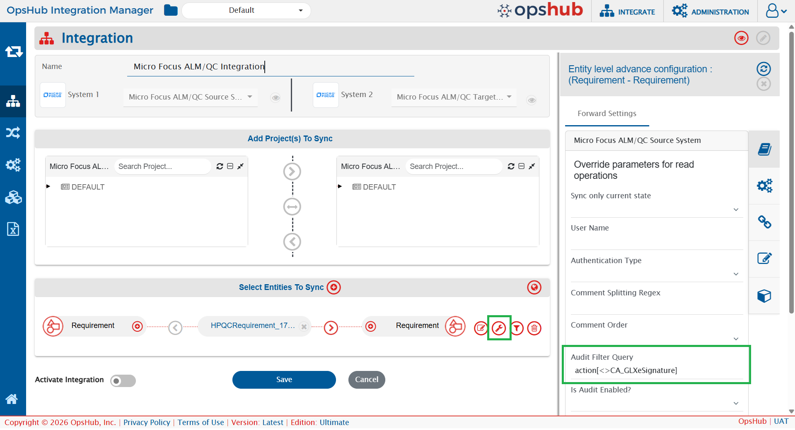

# Description

When user encounters OH-Micro Focus ALM/QC-012656, following error message will appear:

* Micro Focus ALM/QC-012616: Rest request processing Error : 500 Server Error : Probable cause for this error can be either the password entered in the System configuration form is wrong or the server has encountered the condition, which cannot process your request `<request URL>` (Please check the logs for the detailed response from server). `OpsHub-012654: Error Occurred in HPQC CRUD Request execution for operation getMaxUpdateTime <Server Response Stack Trace> org.hp.qc.api.entities.InvalidValueForFieldException: Failed to convert the 'time' field of a 'audit-log'. The object 2000-01-01+00:00:00 cannot be converted to type QcDate&#xD;`
* Micro Focus ALM/QC-012616: Rest request processing Error : 500 Internal Server Error : Probable cause for this error can be either the password entered in the System configuration form is wrong or the server has encountered the condition, which cannot process your request <request URL> (Please check the logs for the detailed response from server). `OpsHub-012654: Error Occurred in HPQC CRUD Request execution for operation getEntityHistorySince <Server Response Stack Trace> org.hp.qc.api.entities.AuditLog$AuditAction.CA_GLXeSignature: No enum const class org.hp.qc.api.entities.AuditLog$AuditAction.CA_GLXeSignature`

# Cause

User will encounter this error in the following scenarios:

* When the user is running integration(s) of release-cycle in <code class="expression">space.vars.OIM</code> having version 7.141 or above **and** your legacy Micro Focus application only accepts `%20` as the encoding of the ` ` (space character) in its API.
* When the Micro Focus ALM/QC server contains an eSignature-related action (`CA_GLXeSignature`) in its audit records that it cannot process, the audit history request fails with 500 Internal Server error.

# Solution

1. If the error occurs because the **`time` field of the audit log cannot be converted**, then:
   * Open the directory where <code class="expression">space.vars.OIM</code> is installed and navigate to the `OpsHub_Resources/config` directory.
   * **Duplicate** the `HPQCProperty.properties.sample` file and **rename** it to `HPQCProperty.properties`.
   * Set the `hpQueryParamEncoding` flag to `true` and restart the OpsHub server service.

2. If the error occurs because of the **`CA_GLXeSignature` audit action**, then:
   * Navigate to the **Entity level advance configuration** section at the **integration level**.
   * Locate the **Audit Filter Query** field.
   * Set the **Audit Filter Query** field to the following value:

     `action[<>CA_GLXeSignature]`

   

     
   

   
   * The configured audit filter excludes the unsupported `CA_GLXeSignature` audit action from the audit API request, allowing the remaining audit history to be retrieved successfully.