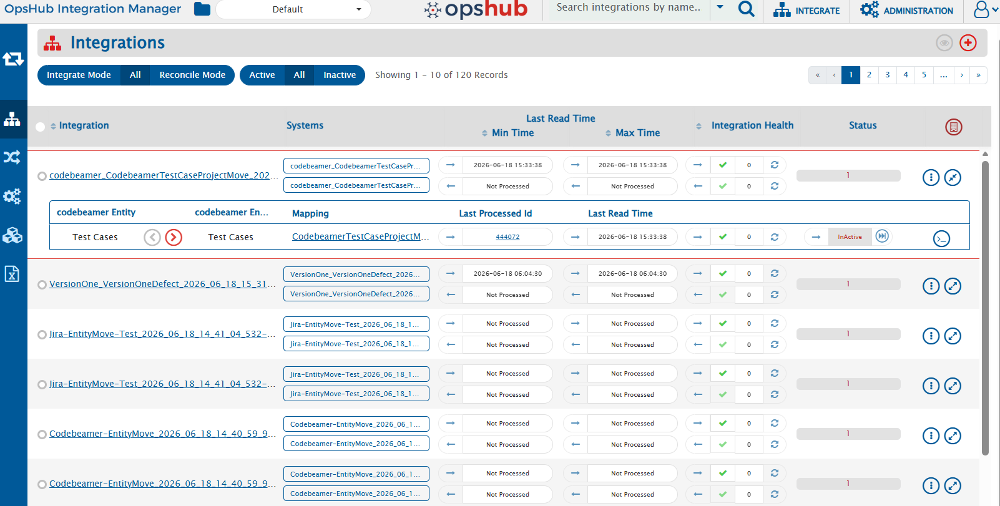

# Sync Report

## Overview

The **Sync Report List View** provides a centralized interface to monitor and analyze integration data. It supports **multi-integration selection** and **advanced filtering capabilities** to refine results effectively.

---

## User Journey

### Step 1: Navigate to Integration Page

1. Log in to the <code class="expression">space.vars.OIM</code>.
2. From the main navigation menu, click on **Integrate**.
3. You will be redirected to the **Integration List View** page.
4. You can expand the integration for which you want to see the integration report.

#  

  

---

### Step 2: Understanding the Sync Report View

On the Sync Report page, you will see:

- A list of synced entities from selected integrations.
- Multi-select option for integrations.
- Filter panel, having multiple filters to view desire data. 
- Search button

Users can select multiple integrations to view synced data of multiple integration.

#  

  

---

### Step 3: Selecting Multiple Integrations

- Use the multi-select dropdown or checkbox list to choose one or more integrations.
- Selected integrations will be included in the report output.

  

- If you turn on the filter on folder, all the synced entities which belongs to current folder's integrations will be visible.

  

---

## Filters

Use the following filters to refine your results:

| Filter Name | Description |
|------------|------------|
| Source Entity | Unique identifier for the source entity |
| Source Entity Type | Type/category of the source entity |
| Source Project Name | Name of the source project |
| Target Entity | Unique identifier for the target entity |
| Target Entity Type | Type/category of the target entity |
| Target Project Name | Name of the target project |
| Last Processed Time (From) | Start date/time for filtering records |
| Last Processed Time (To) | End date/time for filtering records |

---

#  
<!-- Add screenshot of filters section -->

---

## Execute Search

1. Select one or more integrations.
2. Apply the required filters.
3. Click the **Search** button.

The system will:
- Validate inputs
- Fetch filtered data
- Display results in the list view

#  

  

---

## Viewing Results

- The list view updates based on selected filters
- Displays only relevant integration records
- Helps in quick analysis and tracking

### Known Behaviour

- At a time user can select 50 integrations.
- At a time user can export 65000 records.

---