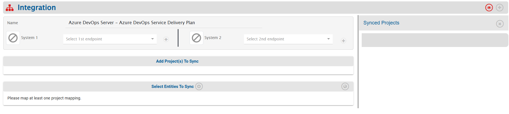
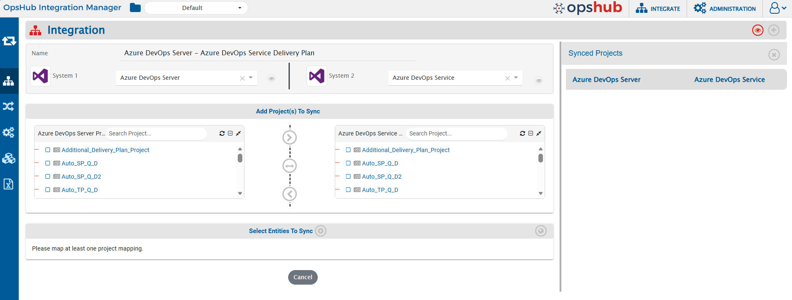
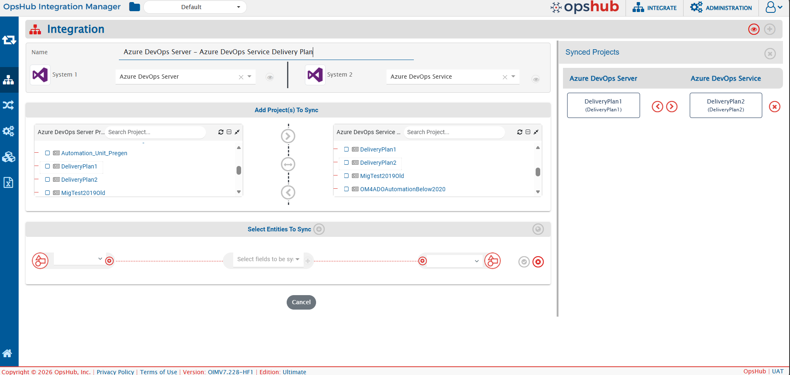
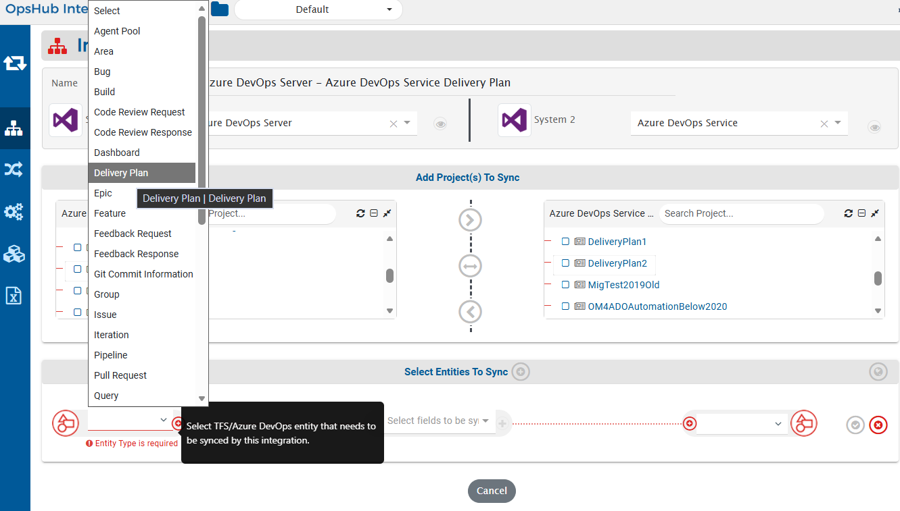
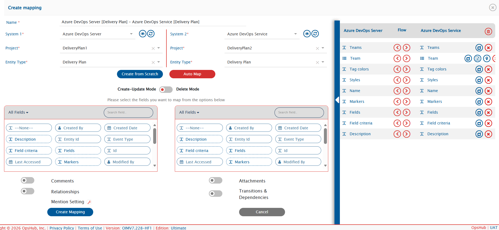
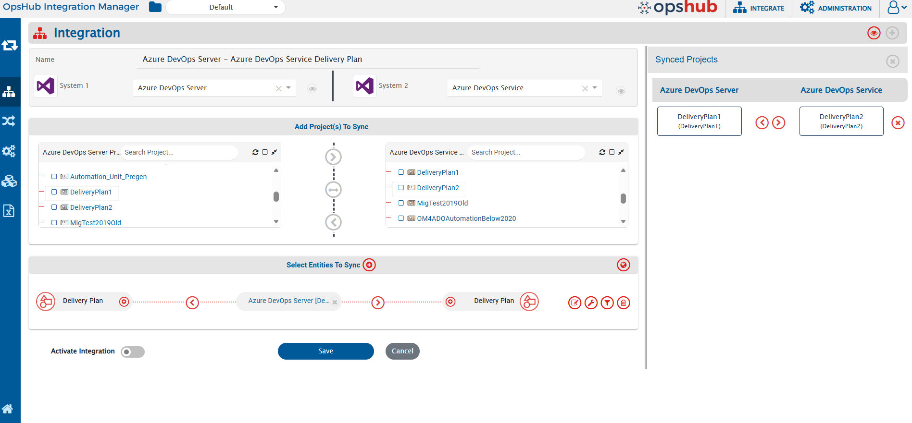
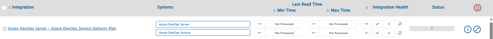

# Overview
Synchronizing Delivery Plans from Azure DevOps Server (TFS) to Azure DevOps Services (ADO) enables teams to maintain consistent roadmap visibility and portfolio planning across their migration journey. This integration ensures that Delivery Plan configurations, team mappings, backlog references and scheduling views are accurately transferred to the target ADO project—eliminating manual setup efforts, preserving planning continuity, and enabling stakeholders to seamlessly track progress and dependencies in the target environment.

**<code class="expression">space.vars.OIM</code>** provides bidirectional integration between Azure DevOps Server (TFS) and Azure DevOps Services (ADO).

This page covers the bidirectional integration of Delivery Plan and their references entities.

# System Prerequisites
* Configuring [system pre-requisites](../../integrate/integration-prerequisites.md) is mandatory for successful system configuration.
* Check out the pre-requisites for [Azure DevOps Server and Azure DevOps Service](../../connectors/azure-devops.md#prerequisites)
* To understand the pre-requisites for enabling Delivery Plan synchronization, refer to the section: [Delivery Plan Prerequisites](../../connectors/azure-devops.md#delivery-plan-prerequisites)

# Integration Configuration
* Log in into **<code class="expression">space.vars.OIM</code>**. The default credentials are:  
  **User Name:** admin, **Password:** password

  

  

>**Note**: **Proxy parameters:** Before you proceed with the configuration, check whether the system is behind a proxy server. If yes, then set up [proxy parameters](../../manage/administrator/proxy-setting.md) in **<code class="expression">space.vars.OIM</code>**.

* Since Delivery Plan references dependent entities such as **Team**, make sure that the Team entities integration has successfully completed before migrating the Delivery Plans .

* Click **Integrate** on the top right corner of the screen and then click the plus [+] icon.

  

* The integration configuration page opens:
  * Integration Configuration for **Delivery Plan** Entity:
    * Enter a unique name for the integration. For example, this integration is named **Azure DevOps Server – Azure DevOps Service Delivery Plan**.
    * Click plus [+] icon adjacent to the System 1 and System 2 fields one by one to configure Azure DevOps Server (TFS) and Azure DevOps Service (ADO).
       

           
       
  

## Configure System(s)
* Configure Azure DevOps Server (TFS) –Azure DevOps Service (ADO) by following the steps given on [Azure DevOps Server/Service System Configuration](../../connectors/azure-devops.md#system-configuration).

  

  

* When you save the respective system configuration pages after configuring the systems, the systems will automatically be added to the integration. Proceed to adding projects and entities in the integration.

  

  

## Select Projects and Entities

* In the **Add Project(s) to Sync** section, select the projects you want to synchronize between Azure DevOps Server (TFS) and Azure DevOps Service (ADO) by clicking them.  
  Example: **DeliveryPlan1** from Azure DevOps Server (TFS) and **DeliveryPlan2** from Azure DevOps Service (ADO).
* Once the projects are selected, define the source project and target project:
  * **Forward (>)** → data flows from Azure DevOps Server (TFS) to Azure DevOps Service (ADO)
  * **Backward (<)** → data flows from Azure DevOps Service (ADO) to Azure DevOps Server (TFS)
  * **Bi-directional (<-->)** → data flows both ways
* Once the direction is selected, the arrows will turn grey. We have selected the bi-directional flow.

  

  

* **<code class="expression">space.vars.OIM</code>** fetches entities available in both systems and shows them in entities list for both systems. From the **Select Entities to Sync** section, select the relevant entities for both systems.  
  Example: **Delivery Plan** from both Azure DevOps Server (TFS) and Azure DevOps Service (ADO).

* The next step is to define the fields that need to be integrated for every entity mapped. Once the entities are selected, click the plus icon [+] adjacent to **Select fields to be Synced** to create the mapping between these two entities. You will now be navigated to Mapping Configuration screen.

  

  

## Mapping Fields

### Entity: Delivery Plan
* From the **Select Entities to Sync**, select the relevant entities for both systems.  
  In this case: **Delivery Plan** from Azure DevOps Server (TFS) and Azure DevOps Service (ADO) . Create a Mapping for this entity as well.
* Following details are automatically populated in the Mapping section: **Systems, Projects, Entities, and Mapping Name**. If you wish, change the name for the mapping in the **Name** field.
* Now, either click **Create from Scratch** to define the mapping from scratch or click **Auto Map** to automatically map all fields with the same name.
* Even if you select the **Auto Map**, **<code class="expression">space.vars.OIM</code>** will allow you to remove or add more fields before saving mapping.
* Since a Delivery Plan references dependent entities, ensure that the mandatory field **Team** and **Teams** are mapped.
* You can also import a mapping. Refer to [Delivery Plan field mapping](delivery-plan-field-mapping.xml) to import the default field mapping from Azure DevOps Services to Azure DevOps Server for the Delivery Plan entity.
  * You may further modify the imported mapping based on your use case.
* Delivery Plan has various fields which require advance mapping for proper sync and handling in <code class="expression">space.vars.OIM</code>.
  * The fields requiring advance mapping are: Teams, Field criteria, Fields, Markers, Tag colors. Refer to the attached mapping above for the advanced mapping for these fields.
* Once the mapping is created, click the **Create Mapping** to create & save this mapping as well.

  

 

## Save Integration
* To save the integration in active mode, slide the **Activate Integration** button to the right.
* As the final step, click **Save** to save the integration.

  

 

* The integration will be created. You will also get a confirmation pop-up at the bottom of the screen, and the integration will be listed in the integrations list.

  

  

## Activate and Test the Integration
* After validating that the synchronization of dependent entities **Team** is successfully completed, activate the **Delivery Plan** integration and test it by synchronizing the Delivery Plan entity.
* Test the integration by synchronizing data between the specified Azure DevOps Server (TFS) and Azure DevOps Service (ADO)  projects.

>**Note**: Do not use the **integration user credentials** to create entities in the systems, as the integration will not work in that case.

* Create/Update event in the source system and check whether the event synchronizes to the target system. Wait for one minute for the data to synchronize.
* If you face any issue, please refer to [possible reasons and their fix](../../help-center/faqs/general-faqs.md).

