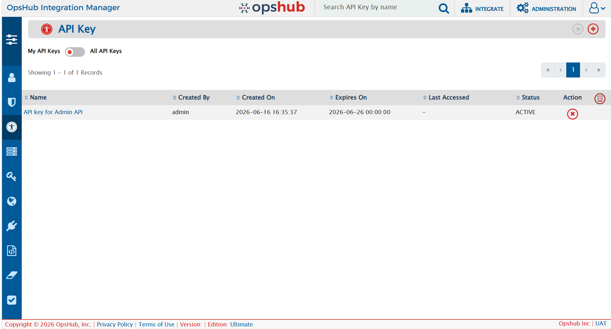
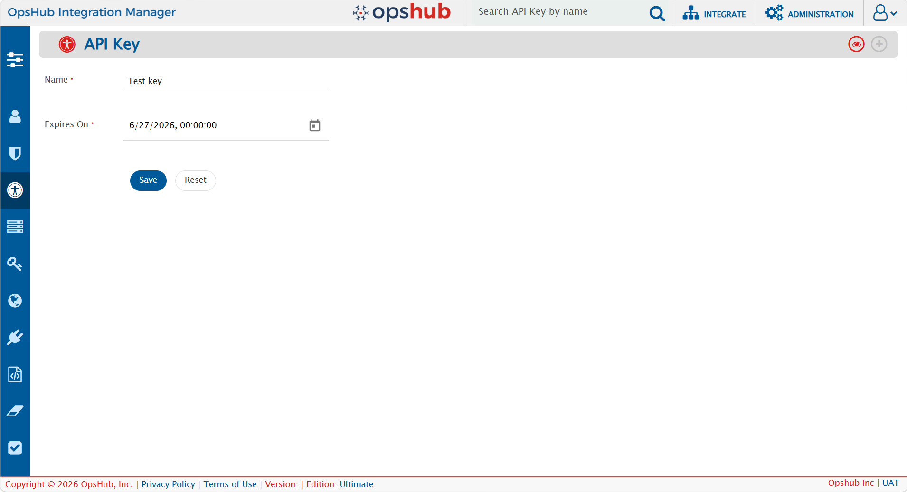
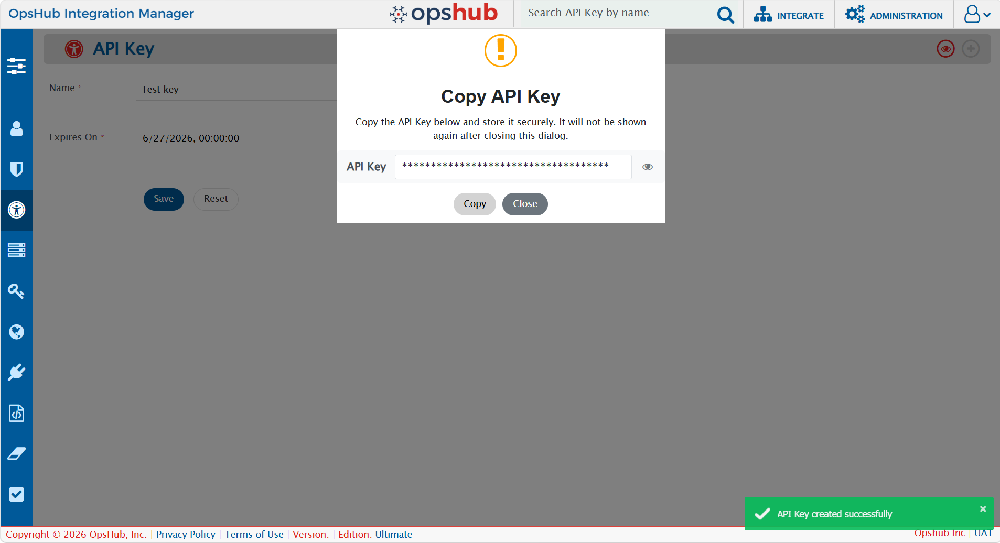
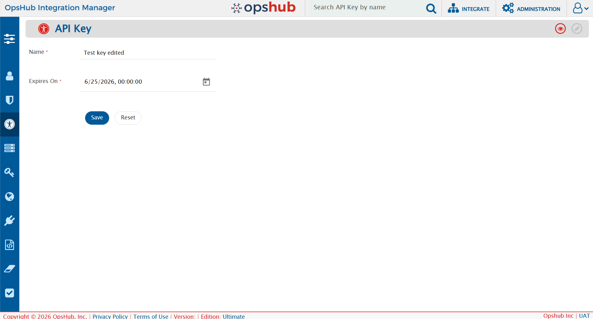
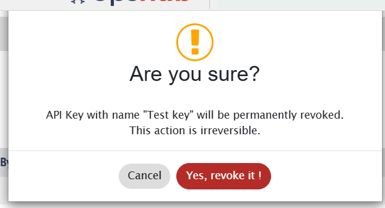

## Overview

API Keys provide a secure, dedicated credential for programmatic access to the [Admin APIs](../api/getting-started-with-api.md) and [MCP integrations](../mcp/mcp-home.md) — without sharing a user's username and password.

- API Keys are generated from the <code class="expression">space.vars.OIM</code> UI and can be revoked at any time.
- An API Key inherits the permissions of the user who created it.
- API Keys are available on the **Professional** and **Ultimate** editions only. To verify your edition, refer to the value shown in the footer of <code class="expression">space.vars.OIM</code>.

> **Note:** API Key authentication is an additional mechanism and does not replace existing Basic Authentication.

---

## Accessing API Key Management

1. Click **Administration**.
2. Select **API key** from the options in the left pane. The **API key** list view opens, showing all keys you have created.

<p align="center">
  
</p>

The list displays the following details for each key:

| Column            | Description                                                            |
|-------------------|------------------------------------------------------------------------|
| **Name**          | The unique label provided when creating the key.                       |
| **Created By**    | The user who created the key**                                         |
| **Created on**    | The timestamp when the key was created.                                |
| **Expires on**    | The configured expiry datetime of the key.                             |
| **Last accessed** | The timestamp of the last successful use of the key.                   |
| **Status**        | The current state of the key: **Active**, **Expired**, or **Revoked**. |
| **Action**        | Option to revoke the key.                                              |

> **Note:** The actual API Key value is never shown here — its only metadata.

---

## Generating an API Key

1. Navigate to **Administration → API key**.
2. Click the **+** button on the top right corner of the screen.

3. The **Create API Key** form opens. Fill in the following details:
   - **Name** *(required)* — A unique name to identify the key.
   - **Expires on** *(required)* — A future expiry datetime, no more than **1 year** from the current date.

<p align="center">
  
</p>

4. Click **Save**. The system generates a cryptographically secure API Key.

5. The generated key is displayed **one time only** in a pop-up. Click **Copy** to copy the key and store it securely.

<p align="center">
  
</p>

6. Click **Close** to dismiss the pop-up. You are redirected back to the API key list view where the newly created key is visible.

> **Note:** After the pop-up is dismissed, the key value cannot be retrieved again. If the key is lost, a new key must be generated.

---

## Using an API Key

Once generated, an API Key can authenticate requests to the **Admin API** and **MCP** endpoints. Pass the key in one of the following request headers:

```
x-api-key: <api-key>
```

or

```
Authorization: ApiKey <api-key>
```

On a successful request, the **Last accessed** timestamp of the key is updated automatically. If the key is invalid, expired, or revoked, a **401 Unauthorized** response is returned:

```json
{
  "errorMessage": "Authentication failed. Valid credentials are required to access this resource.",
  "stackTrace": null
}
```

---

## Editing an API Key

An API Key can be edited only while it is in the **Active** state.

1. Navigate to **Administration → API key**.
2. Click on an active key to open its details.
3. Click the edit button on the top right corner.
4. Update the **Name** and/or **Expires on** fields. The same field validations apply as when creating a key.
5. Click **Save**.

<p align="center">
  
</p>

> **Note:** Editing is not available for expired or revoked keys — the edit option will be disabled for those keys.

---

## Revoking an API Key

1. Navigate to **Administration → API key**.
2. Click the **✕** button against the key you want to revoke in the **Action** column.
3. A confirmation prompt appears: *"API key with name &lt;api-key-name&gt; will be permanently revoked. This action is irreversible."*
4. Click **Yes, revoke it!** to confirm.

<p align="center">
  
</p>

After revocation:

- The key remains visible in the list with a **Revoked** status — it is not deleted.
- Any subsequent request using that key returns a **401 Unauthorized** response.
- A revoked key cannot be reactivated. If access is required again, a new key must be generated.

---

## API Key Statuses

Every API Key has one of the following statuses:

| Status | Description |
|--------|-------------|
| **Active** | The key is valid and can be used to authenticate requests. |
| **Expired** | The configured expiry datetime has been reached. The key can no longer be used. |
| **Revoked** | The key has been manually revoked. It cannot be used, restored, or reused. |

A newly created key starts in the **Active** state. **Expired** and **Revoked** are terminal states — a key in either state cannot be restored or reused.

---

## Audits

All actions performed on API Keys are logged and can be viewed from the **API key audits** screen. Each audit entry captures the **Name**, **Author**, **Change Time**, **Revision Type**, and changed field values.

The following events are audited:

- **Create** — records the Name and Expires on value of the newly created key.
- **Update** — records changes to the Name and/or Expires on value.
- **Revoke** — records the Status change from Active to Revoked.

---

## User Access Control

- Any authenticated user, irrespective of role, can generate and manage their own API Keys.
- A user can only view and manage their own keys — they cannot view, modify, or revoke keys created by another user.
- By default, only the **Super Admin** can manage API Keys across all users. Users with the **User Management – Write** permission in a custom role can also view and manage API Keys of other users. Refer to [User Access Control](user-access-control.md) for more details.

---

## Known Behaviors and Limitations

| Behavior                          | Detail                                                                                             |
|-----------------------------------|----------------------------------------------------------------------------------------------------|
| **Key shown once**                | After generation, the key value cannot be retrieved. A new key must be generated if it is lost.    |
| **Revocation is immediate**       | Once revoked, a key cannot be restored. A new key must be generated if needed.                     |
| **No key rotation**               | In-place key rotation is not supported. Generate a new key and revoke the old one.                 |
| **No per-key permission scoping** | API Keys inherit the generating user's full permissions — granular scope control is not supported. |
| **Deleted user keys**             | All API Keys of a deleted user are revoked automatically and cannot be reactivated.                |