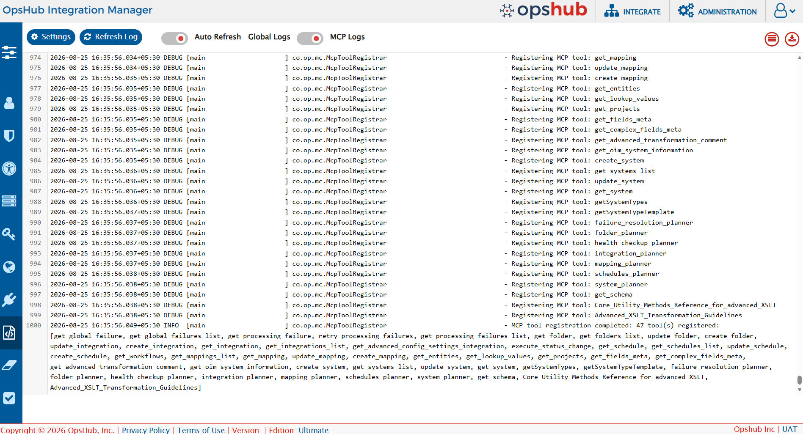

# Different Types of Logs

There are different logs maintained and stored under **<code class="expression">visitor.claims.unsigned.product</code>'s `<Installation Folder>\AppData\logs`** during the installation process and one log is maintained to track the ongoing processing in \<code class="expression">space.vars.OIM</code>.

| **Log File Name**      | **Description**                                                                                              |
| ---------------------- |--------------------------------------------------------------------------------------------------------------|
| DatabaseCreation.log   | Log generated during Database Creation phase of Installation                                                 |
| Install.log            | Log related to installation steps                                                                            |
| OpsHubServer.log       | Log generated while <code class="expression">visitor.claims.unsigned.product</code> Installation (like launching URL).   |
| Service.log            | Log generated while registering <code class="expression">visitor.claims.unsigned.product</code> Application as Service.  |
| ConnectionModeConf.log | Log related to the Connection Mode Configuration.                                                            |
| OpsHub.log             | <code class="expression">visitor.claims.unsigned.product</code> Application log file for all the migrations/integrations |
| OpsHubTFSService.log   | Common log file for TFS API interaction                                                                      |
| MCPServer.log          | Logs related to MCP Server (Tool registerations, Tool Call requests, Tool Call responses)                                |
| Integrations           | Folder contains the files for the logs of each migrations/integrations                                       |

  
# Log Settings

System log helps to view logs for tracking backend activity in <code class="expression">space.vars.OIM</code>. Usually logs are useful when any failure or unusual behavior is detected in integration. System log can store logs in 5 different levels. Logs will capture information based on logging level set in System log.

To navigate to System log

* Click on Administration on top right corner.
* On Left panel click on Global log as shown below

<p align="center">
  
</p>

> **Note**: The Global Log screen also provides a **Global Logs / MCP Logs** toggle to switch between system logs and MCP logs. Refer to [MCP Logs](log-viewer.md#mcp-logs) below for details.


## Settings

Click on Setting button on System log window to configure log settings as mentioned below

<p align="center">
  
</p>


## Integration Log Setting

**Class/Package Name:** The name of the package or class for which logs need to be monitored. To monitor the logs within the 'com.opshub', package 'com.opshub' should be entered here.

**Log Level:** Represents the logging level which determines the amount of information recorded in the log files. By default, only Error logged in <code class="expression">space.vars.OIM</code> are logged in logs. The coverage of information increases in ascending order from logging level 1 to 6.

1-FATAL, 2-ERROR, 3-WARN, 4-INFO, 5-DEBUG, 6-TRACE

1-FATAL will log minimum amount of data, not sufficient for tracking integrations, while 6-TRACE will log maximum data, most useful for tracking integration but it also creates log sizes and creates multiple log files due to amount of information logged.

**No. of Lines:** Number of lines of logs to be displayed on the log viewer screen of the UI.

**No. of max backup log files:** Maximum number of backup files to store excluding the current log file used by the integration.

**Size of log file [MB]:** Maximum size (in MB) that an integration log file can have before a new backup log file is created.

**Reset all integrations to global log settings?:** This option reverts all individual/custom log settings for each integration to the global/default log configuration defined at the system level. Any integration-specific overrides will be removed.

## Global Log Setting

**No. of max backup global log files:** Select the maximum number of backup files to store, excluding the current log file used by the UI logs.

**Location to save logs:** Location where log files should be saved, this should be configured if default directory where <code class="expression">space.vars.OIM</code> is installed do not have sufficient space to store log files. By default, logs are stored in default directory where <code class="expression">space.vars.OIM</code> is installed.

* If you change the default location to another location, all the older logs will be copied to the updated location, except for Tomcat Server logs. The new logs will be logged at the updated location.

**Size of global log files [MB]:** Select the maximum size (in MB) that a UI log file can have before a backup log file is created.

**Compress Backup Log Files:** Enable the toggle button to store all the backup log files in **compressed(.zip)** format.

> **Note**: Following points should be considered:

* When the toggle button for 'Compress Backup Log Files' is enabled or disabled, ensure that no other application is using the backup files.
* When the toggle button for 'Compress Backup Log Files' is enabled or disabled, ensure to configure the values for 'No. of max backup global log files' and 'No. of max backup log files' appropriately.

## Refresh Log

<p align="center">
  
</p>


**Refresh log** button on the top of window can be used to refresh logs once to display latest logged data.

<p align="center">
  
</p>


**Auto Refresh Log** is a toggle button, it can be set on to automatically refresh logs in every few seconds (2-3 seconds).

## Export Logs

<p align="center">
  
</p>


Click on Export logs button to export logs as zip file.

## Word Wrap

<p align="center">
  
</p>


Click on Word Wrap to enable/disable the word wrapping behavior in the log viewer.

* Word wrap is enabled by default.
* When word wrap is enabled, long log entries are wrapped, making them easier to read without horizontal scrolling.
* When word wrap is disabled, log entries remain on a single line, preserving the visual alignment of timestamps and structure. However, horizontal scrolling may be needed.

## MCP Logs

The Global Log screen provides a **Global Logs / MCP Logs** toggle to view logs related to the <code class="expression">space.vars.OIM</code> MCP Server, without having to access the `MCPServer.log` file on the server directly.

<p align="center">
  
</p>

No additional configuration or pre-requisites are required to view MCP logs. MCP related logs are read directly from the `MCPServer.log` file stored on the server; no separate database storage is used.

### Access Control

* Users with the **Server Management Read** admin permission can view MCP logs.
* By default, the Super Administrator can view MCP logs.
* If the current license edition does not include the MCP Server feature, the **MCP Logs** toggle on the Global Log screen is disabled. Hovering over the disabled toggle shows the message:

  > Current license doesn't cover "MCP Server" feature. Please reach out to your sales point of contact to upgrade the license.

### Types of MCP Logs

MCP logs are of two types:

* **MCP Tool Call logs** — logged for every tool call made through the MCP server.
* **MCP Server logs** — logged for MCP server level activity such as startup.

#### MCP Tool Call Logs

* **Tool Call Requested log**: Logged when a tool call is received. Includes the name of the tool called and the arguments it was called with.
* **Tool Call Response log**: Logged once tool execution completes. Includes the status of execution (Success/Fail), the tool response on success, and the execution error if the tool call failed.

Every tool call log line also includes the **username** of the user who called the tool, and the [correlation ID](log-viewer.md#correlation-id-reqid) for that call.

Example of a tool call request and its matching response:

```
2026-08-13 10:38:26.570+05:30 DEBUG [boundedElastic-1] co.op.mc.McpToolRegistrar
 - [User:admin] [ReqId:448d8ff2-dab5-4da6-ba8a-24bdde8e57c9] Executing tool=get_mappings_list with arguments={listParams={searchText=, pagination={pageSize=100, startAt=1, totalNumberOfRecords=0}, filterList=[], sortBy=[{orderType=ASCENDING, sortBy=name}]}}

2026-08-07 15:14:17.934+05:30 DEBUG [boundedElastic-2] co.op.mc.McpToolRegistrar
 - [User:admin] [ReqId:335d8ff2-dab5-4da6-ba8a-24bdde8e58e2] Successfully executed MCP tool: get_system, Tool Call Result: ...
```

If a tool call fails, the error is logged with the same correlation ID, for example:

```
2026-08-13 16:08:57.967+05:30 ERROR [boundedElastic-9] co.op.mc.McpToolRegistrar -
Error executing MCP tool: update_system [ReqId=7ac3dc9a-0a5d-4366-a966-896873dc7f2c]
java.lang.reflect.InvocationTargetException ...
```

#### MCP Server Logs

* **Tool registration logs**: Logged when the MCP server starts up and registers its available tools.
* **Authentication header set log**: Logged only when a user is connecting to the MCP server using the username/password headers option (Basic Auth). It confirms that the incoming username/password headers were synthesized into a standard Basic `Authorization` header for downstream authentication:

  ```
  MCP request had username/password headers; synthesized Basic Authorization header for downstream authentication.
  ```

### Correlation ID (ReqId)

* Every MCP tool call is assigned a unique correlation ID when it starts. This ID is a randomly generated 32-character UUID string, and it appears on every log line produced by that call as `[ReqId:<id>]`.
* Since multiple users and multiple tool calls can run at the same time, their log lines get interleaved in the log file. The correlation ID identifies which log lines belong to the same tool call.
* To trace a single tool call end-to-end, search the log for its correlation ID — this returns the request, the response, and any error logged for that call.
* If a tool call fails, the same correlation ID is included in the error returned to the client. A user reporting an issue can share this ID so the exact call can be located in the log.

### Sensitive Data Handling

* Sensitive values are never written to MCP logs in readable form. Any data that looks like a credential — passwords, tokens, API keys, secrets, and similar — is masked with `********` before the log line is written.
* This masking applies to both the tool call request and the tool call response.

### Large Response Handling

* Tool results returned to the MCP client are not size-capped; a "list" style tool returns its complete result set to the client.
* To prevent the `MCPServer.log` file from being flooded by a single large result, the copy of the result written to the log is capped at 10,000 characters. If the result exceeds this limit, the logged line is truncated with the marker `... [log truncated: showing first 10,000 of N characters]`. This truncation only affects what is logged — the client always receives the complete result.

### Log Settings

MCP logs share the same log settings as Global logs (see [Settings](log-viewer.md#settings) above). Hovering over the **i** icon on the MCP Logs settings sidebar shows the following message:

> Changes to settings apply to all logs (including Global logs), not just MCP.

  
