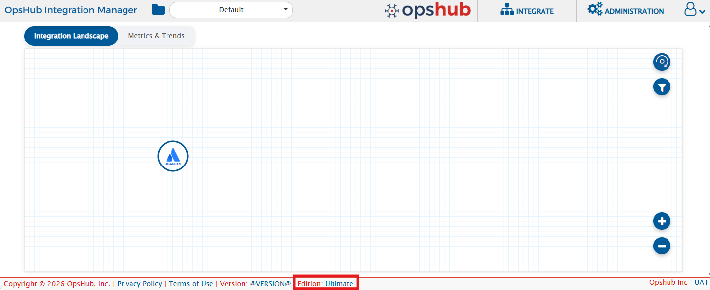
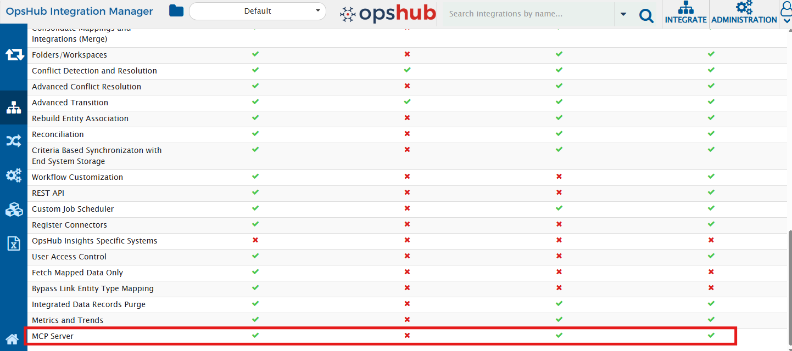

# Overview

Consider asking your AI assistant _"How many integrations are currently running in OIM?"_ or _"Create an integration between Jira and Rally for Project Alpha"_ - and getting it done instantly. The <code class="expression">space.vars.OIM</code> MCP (Model Context Protocol) server connects your AI assistant directly to your <code class="expression">space.vars.OIM</code> instance, enabling you to query, configure, and manage integrations through natural language - while fully preserving the security and role-based access controls configured in <code class="expression">space.vars.OIM</code>.

> **Tip**: For best results, it is recommended to also connect the **OpsHub Documentation MCP** alongside the <code class="expression">space.vars.OIM</code> MCP server. This allows your AI assistant to access OpsHub product documentation - including connector,  providing richer context when generating configurations.

To explore what operations are supported, kindly refer to [MCP Capability Matrix](mcp-capability-matrix.md).  
To get started with sample interactions, kindly refer to [Sample Use Cases](mcp-sample-use-cases.md).

---

# Prerequisites

## License

MCP server access is available with the **Professional** and **Ultimate** editions of <code class="expression">space.vars.OIM</code>. It is **not available** with OM4ADO.

To verify whether the MCP feature is enabled on your instance:

1. [Login](../../getting-started/logging-in.md) to <code class="expression">space.vars.OIM</code>.
2. Navigate to the Footer and click on the **Edition**.
<p align="center">

</p>
3. Confirm that the **MCP** feature is listed as enabled.
<p align="center">

</p>

> **Note**: If the MCP feature is not enabled and you have a license that should include it, please [install](Managing_Licenses) the correct license. If you do not have a valid license, please reach out to the OpsHub Sales/Support team.

## User requirements

- A valid <code class="expression">space.vars.OIM</code> user account with appropriate roles and permissions to perform the desired operations via MCP.

> **Recommendation**: A dedicated user of OIM rather than individual user accounts improves traceability of all actions performed via MCP and ensures access is limited to only the permissions needed. To create a new user, navigate to **Administration → User Management** in <code class="expression">space.vars.OIM</code> and create a new user with the appropriate role.

## MCP-compatible AI client

The MCP server works with any client that supports the Model Context Protocol over HTTP. Supported clients include:

- [Claude Desktop](https://claude.ai/download)
- [Claude Code](https://docs.anthropic.com/en/docs/claude-code/getting-started)
- [Visual Studio Code](https://code.visualstudio.com/) with a compatible MCP extension (Github Copilot)
- [Cline](https://github.com/cline/cline)
- [Continue](https://www.continue.dev/)
- Any other MCP-compatible client that supports HTTP transport

---

# Accessing the MCP server

The <code class="expression">space.vars.OIM</code> MCP server is available at the following endpoint:

```
<OpsHub Integration Manager URL>/OpsHubWS/mcp
```

**For example** — If your <code class="expression">space.vars.OIM</code> application URL is `http://10.13.20.20:8989/OIM/`, then the MCP endpoint will be:

```
http://10.13.20.20:8989/OpsHubWS/mcp
```

To configure your AI client to connect to this endpoint, kindly refer to [Configuration](mcp-configuration.md).
