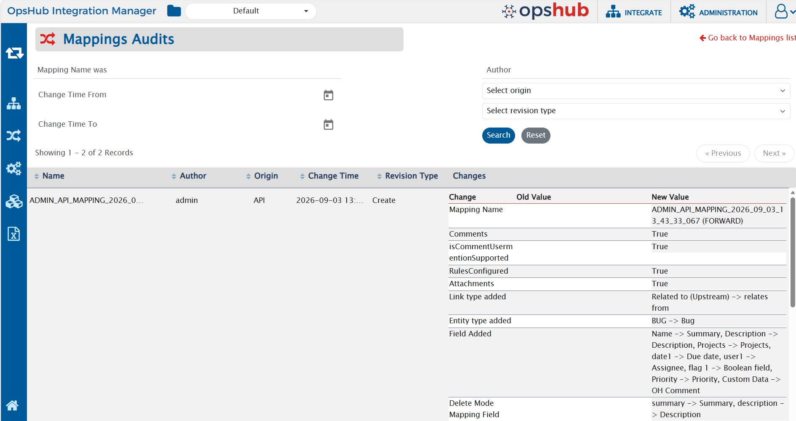

## Audit Origin

<code class="expression">space.vars.OIM</code> records an audit entry for every configuration change made in the application, capturing the entity that was changed, the user who changed it, when the change was made, the type of change, and the field-level values that changed.

Along with these details, every audit entry records the **Origin** of the change - the channel through which the change was made. As the same user can make changes from the <code class="expression">space.vars.OIM</code> UI, through the Admin API, or through an MCP client, **Origin** makes it clear which of these was used, and allows the changes made through MCP to be reviewed separately.

Audits are available for all audited entities, such as **Systems**, **Integrations**, **Mappings**, **Workflows**, **Users**, **Roles**, **Login Servers**, **Excel Uploads**, **Job Schedules**, **API Keys**, and **Processing Failures**. To view them, click the audit icon on the top right corner of the respective list view. The **Origin** column and its filter are available on all these audit screens.

<p align="center">
  
</p>

### Origin values

| Value   | Description                                                                                 |
|---------|---------------------------------------------------------------------------------------------|
| **UI**  | The change was made from the <code class="expression">space.vars.OIM</code> user interface.  |
| **API** | The change was made through the [Admin API](../api/getting-started-with-api.md).             |
| **MCP** | The change was made through an [MCP](getting-started-with-mcp.md) client.                    |

> **Note**: **Origin** always reflects the channel from which the change was originally initiated. For example, a change initiated from an MCP client is always recorded as **MCP**, irrespective of how it is processed internally.

### Filter and sort audits by Origin

- The **Origin** filter is available on every audit screen, placed after the **Author** filter and before the **Revision Type** filter. Select a value to view only the changes made through that channel - for example, select **MCP** to review all the changes made from an MCP client. Click **Reset** to restore the default view.
- The **Origin** column can be sorted in the same way as the other columns, which is useful to group all the changes of a channel together.
- Filtering and sorting on the existing columns remain unchanged.

### Notes

- **Historical audits are backfilled with the Origin value `UI`.** Audit entries created before this upgrade do not have a recorded channel, as **Origin** was not captured at that time. To keep the audit trail complete and consistent, all such existing entries are displayed with **Origin** as **UI**.
- All the changes made after the upgrade - from the UI, the Admin API, or an MCP client - carry their actual **Origin**.
- Changes made through an MCP client or the Admin API after the upgrade are recorded against the user whose credentials are used and are displayed on the audit screens, along with their **Origin**. Such changes recorded before the upgrade continue to remain as they are and are not displayed.
- The audit records the <code class="expression">space.vars.OIM</code> user whose credentials are used. If a shared or a service account is used for MCP or API access, that account is recorded as the **Author**. Use individual user accounts or per-user [API Keys](../administrator/api-key-management.md) where the attribution of an individual person is required.

---

## MCP logs

The <code class="expression">space.vars.OIM</code> MCP server writes its activity to a dedicated log file. The log file captures all incoming MCP requests and tool invocations.

The MCP log file is located at:

```
<OpsHub Installation Directory>\AppData\logs\MCPServer.log
```

**For example** — On a default Windows installation:

```
C:\Program Files\OpsHub\AppData\logs\MCPServer.log
```

> **Note**: The installation directory may differ depending on the path chosen during setup.

### What the logs contain

Each log entry follows this format:

```
<Timestamp> <Log Level> [<Thread>] <Class> - <Message>
```

For example:
```
2026-05-27 14:55:22.194+05:30 DEBUG [boundedElastic-3] co.op.mc.McpToolRegistrar - Executing tool=get_schema with arguments={toolName=update_system}
2026-05-27 14:55:40.301+05:30 DEBUG [boundedElastic-3] co.op.mc.McpToolRegistrar - Successfully executed MCP tool: update_system, Tool Call Result: ...
```

Typical entries include:

- **Tool invocations**: Logged  with prefix `Executing tool=<tool_name>` — shows the tool called and the arguments passed
- **Tool results**: Logged  with prefix `Successfully executed MCP tool: <tool_name>` — shows the result returned

## Debugging

- **To verify MCP server started and tools are registered**: Search for `Registering MCP tool` — confirms the MCP server started and all tools are available.
- **To check if an MCP request is being processed**: Search for `Executing tool=<tool_name>` (e.g., `Executing tool=get_integrations_list`) — confirms the request reached the server and processing has begun.
- **To check the result of a processed request**: Search for `Successfully executed MCP tool: <tool_name>` — confirms the request completed and returned a result.
- **To find failures**: Search for `ERROR` or `WARN` in the log.
---

## Common issues

- [AI assistant does not connect to MCP Server](#ai-assistant-does-not-connect-to-mcp-server)
- [Authentication failure](#authentication-failure)
- [Tool calls succeed but return unexpected results](#tool-calls-succeed-but-return-unexpected-results)
- [HTTPS / SSL certificate errors](#https--ssl-certificate-errors)

---

### AI assistant does not connect to MCP server

**Symptom**: The AI client reports that it cannot connect to the MCP server, or no OpsHub tools appear.

**Resolution**:
1. Verify the MCP endpoint URL is correct: `<OpsHub Integration Manager URL>/OpsHubWS/mcp`
2. Confirm the <code class="expression">space.vars.OIM</code> instance is running and accessible — open it in a browser to verify.
3. Check that no firewall or proxy is blocking the connection to the <code class="expression">space.vars.OIM</code> host and port.
4. In the log file, check whether `Registering MCP tool` entries are present — if absent, the MCP server did not start correctly.

### Authentication failure

**Symptom**: The AI client connects but operations return authentication or authorization errors.

**Resolution**:
1. Verify the username and password (or Base64-encoded `Authorization` header value) in your client configuration are correct.
2. Confirm the user account is a local <code class="expression">space.vars.OIM</code> user — LDAP and SAML accounts cannot authenticate via MCP.
3. Confirm the user has the required roles and permissions for the operations being attempted.

### Tool calls succeed but return unexpected results

**Symptom**: The AI assistant invokes tools successfully but the data returned seems stale or incorrect.

**Resolution**:
- Add _"Do not use previously fetched data"_ to your prompt. AI assistants may cache tool results within a conversation session, so this forces a fresh query to <code class="expression">space.vars.OIM</code>.

### HTTPS / SSL certificate errors

**Symptom**: The MCP client reports an SSL certificate error when connecting to an HTTPS <code class="expression">space.vars.OIM</code> instance.

**Resolution**:
Refer to the [HTTPS Configuration](mcp-configuration.md#https-configuration) section for steps to trust your server's certificate in the MCP client environment.
