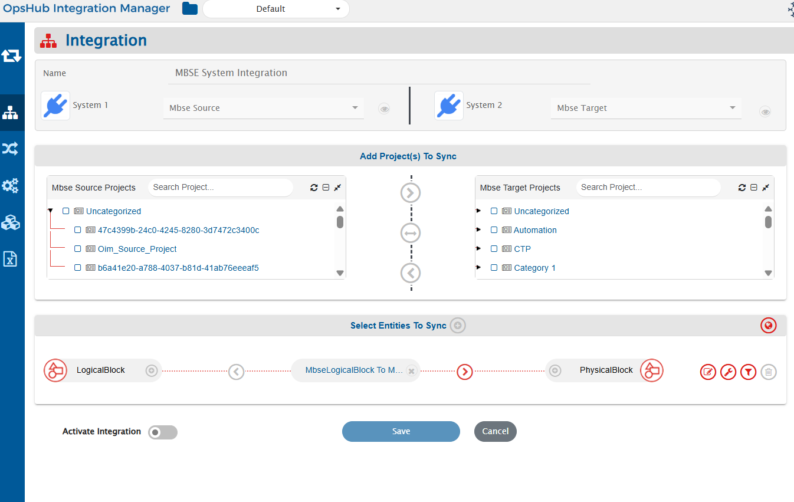

# Behavior for Locked Entities


## Overview

OpsHub Integration Manager (OIM) provides a configurable option to control synchronization behavior when the target system entity is currently locked by another user.

The **Behavior for Locked Entities** configurations helps user determine whether synchronization should wait  till the entity is unlocked or overwrite the lock and make the updates the target entity

This configuration helps user to balance between protecting user changes and maintaining uninterrupted synchronization.

---
## How to Configure

1. Click on Edit Integration Page.
    
   <p align="center">
     
   </p>
2. Click the **Global Configuration** icon.

   <p align="center">
     
   </p>
3. In the **Global Level Advanced Configuration** section, locate **Behavior for Locked Entities**.

<p align="center">
  
</p>

## Available Options

| Option                       | Behavior                                                                                                  |
| ---------------------------- |-----------------------------------------------------------------------------------------------------------|
| **Create Failure (Default)** | Stops synchronization when the entity is locked by non-integration user and creates a processing failure. |
| **Sync**                     | Continues synchronization and updates the entity even when it is locked.                                  |

---
### Create Failure (Default)

* OIM checks whether the entity is currently locked, by non-integration user.
* If the entity is locked by non-integration user, synchronization for that entity is stopped.
* A processing failure is generated.
* Synchronization can be retried after the entity is unlocked.

Example failure message:

```text
Unable to update the element with elementId: {elementId}, as is currently locked by {john.doe} user. Please retry after the element is unlocked.
```

If multiple entities are locked, OIM displays affected element IDs and summarizes additional locked entities when applicable in the processing failure error message.

### Sync

* OIM ignores lock validation.
* Synchronization continues normally.
* Changes are written to the locked entity.

> ⚠️ **Use the Sync option carefully**

When **Sync** is selected, OIM updates entities even if another non-integration user currently holds a lock in the system.

This may result in:

* Overwriting changes actively being performed by users in the system.
* Loss of in-progress edits.

Select **Sync** only when uninterrupted synchronization is preferred over preserving active user modifications.


4. Click **Save** to apply the configuration.
