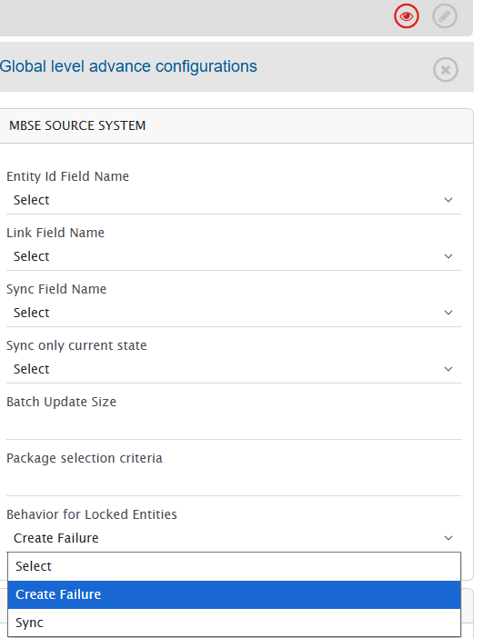

# Behavior for Locked Entities

OpsHub Integration Manager (OIM) provides a configurable option to control synchronization behavior when the target system entity is currently locked by another user.

The **Behavior for Locked Entities** setting determines whether synchronization should stop with a processing failure or continue and update the target entity.

This configuration helps organizations balance between protecting user changes and maintaining uninterrupted synchronization.

---

## Overview

During synchronization write operations, OIM may encounter entities in the system that are currently locked by non-integration user.

The **Behavior for Locked Entities** configuration controls how OIM responds in this scenario:

* **Create Failure (default)** — OIM stops synchronization for the locked entity and reports a processing failure.
* **Sync** — OIM proceeds with synchronization and writes changes even if the entity is locked.

This setting allows teams to choose between preserving active user modifications and maintaining uninterrupted synchronization.

---
## Configuration Steps

1. Navigate to **Configuration Integrations**.
2. Select the required integration to open the integration configuration page.
3. Click the **Global Configuration** icon.
4. In the **Global Level Advanced Configuration** section, locate **Behavior for Locked Entities**.
5. Select the required synchronization behavior.
6. Click **Save** to apply the configuration.

---

## Available Options

| Option                       | Behavior                                                                                                  |
| ---------------------------- |-----------------------------------------------------------------------------------------------------------|
| **Create Failure (Default)** | Stops synchronization when the entity is locked by non-integration user and creates a processing failure. |
| **Sync**                     | Continues synchronization and updates the entity even when it is locked.                                  |

---

## How It Works

When OIM attempts to update an entity in the system:

### Create Failure (Default)

* OIM checks whether the entity is currently locked, by non-integration user.
* If the entity is locked by non-integration user, synchronization for that entity is stopped.
* A processing failure is generated.
* Synchronization can be retried after the entity is unlocked.

Example failure message:

```text
Unable to update the element with elementId: {elementId}, as is currently locked by {john.doe} user. Please retry after the element is unlocked.
```

If multiple entities are locked, OIM displays affected element IDs and summarizes additional locked entities when applicable in the processing failure error message.

---

### Sync

* OIM ignores lock validation.
* Synchronization continues normally.
* Changes are written to the locked entity.

---

## Important Considerations

> ⚠️ **Use the Sync option carefully**

When **Sync** is selected, OIM updates entities even if another non-integration user currently holds a lock in the system.

This may result in:

* Overwriting changes actively being performed by users in the system.
* Loss of in-progress edits.

Select **Sync** only when uninterrupted synchronization is preferred over preserving active user modifications.

---

## Example Configuration Screen

<p align="center">
  
</p>

---